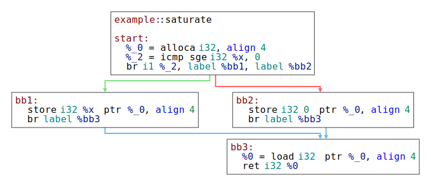
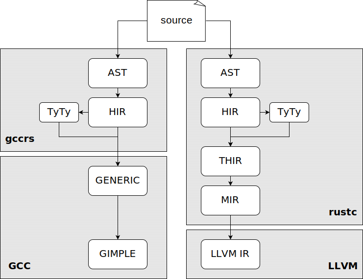
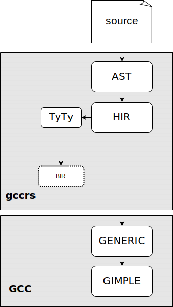

\clearpage
\pagenumbering{arabic}

# Introduction

Rust is a modern systems programming language that aims to provide memory safety without runtime overhead[@Matsakis2014]. To achieve this goal, a Rust compiler has to perform a static analysis to ensure that the memory safety rules are not violated. This analysis is commonly called the _borrow checker_. The borrow checker is a complex analysis that has been evolving throughout the history of the Rust language and its reference implementation compiler, _rustc_. It evolved from a simple lexical analysis to a control-flow sensitive analysis, gradually providing a more precise validation. The experimental version of the rustc compiler uses a new analysis engine and algorithm called _Polonius_. The algorithm changes some fundamental views on the internal semantics of the analysis to allow more programs to be accepted and provides better error reporting for rejected programs[@RustBelt]. The [Polonius Working Group](https://rust-lang.github.io/compiler-team/working-groups/polonius/) is planning to replace the current rustc borrow checker with one based on Polonius in the Rust language edition 2024[@poloniusupdate].

Rust GCC, also known as gccrs, is one of the emerging alternative Rust compilers. Unlike mrustc and rustc_codegen_gcc, gccrs aims to build a complete general-purpose Rust compiler independent of rustc. Gccrs aims to offer a rustc-compatible, drop-in replacement, capitalizing on the mature and diverse features of the GCC infrastructure. GCC (compared to LLVM) offers more target platforms and different optimizations and provides security plugins (originally designed for C) that could be used to find errors in [_unsafe_](https://doc.rust-lang.org/reference/unsafety.html) Rust code[@eurorust]. The goal of this thesis was to start the development of a Polonius-based borrow checker in gccrs.

The first chapter introduces the problem of borrow checking. It gives a brief overview of the development of the borrow checker in the rustc compiler, up to the Polonius project. The second chapter describes the Polonius analysis engine and its API. The third chapter compares the internal representations of rustc and gccrs to highlight the challenges of adapting the rustc borrow checker design to gccrs. The next chapter explains the design of the borrow checker implemented in gccrs as part of this work. It maps the experiments that lead to the current design and describes the new intermediate representation and its usage in the analysis. Later sections of the chapter describe other modifications of the rest of the compiler necessary to support borrow checking. The final chapter elaborates on the implementation, its development, the current state and the known missing features and limitations.

# The Problem of Borrow Checking

This section introduces the concept of borrow checking and traces its development within the Rust programming language. It presents the simple lexical approach, followed by an explanation of a more advanced control-flow sensitive analysis and an introduction to the Polonius analysis engine, the latest approach to borrow checking in Rust. Since this work utilizes the Polonius engine, it is described in more detail in the following chapter.

Typical programming language implementations manage memory with dynamic storage duration in one of two ways[^bc1]. Languages like C employ manual memory management, where programmers explicitly allocate and free memory, a method prone to errors[@nsa]. In contrast, higher-level languages such as Java and Python use automatic memory management, where runtime garbage collectors handle memory management tasks. 

Addressing the pitfalls of manual memory management, languages like C++ and [Zig](https://ziglang.org/) have introduced tools for more implicit memory deallocation. In simple situations, these tools tie memory deallocation to the destruction of objects, utilizing concepts like [RAII](https://en.cppreference.com/w/cpp/language/raii), [smart-pointers](https://en.cppreference.com/w/cpp/memory#Smart_pointers), and [defer statements](https://ziglang.org/documentation/master/#defer). Here, the key difference from stack allocation is that the ownership can be dynamically transferred between objects. In more complex situations, where multiple objects share memory and deallocation is tied to the last object's destruction, these languages opt-in for runtime solutions like [reference counting](https://en.wikipedia.org/wiki/Reference_counting).

Despite these improvements, two serious problems remain. First, programmers can incorrectly establish and maintain ownership binds, especially during dynamic ownership transfers between objects. This issue can very often occur when interfacing systems with differing memory management models[^bc2]. Second, issue appears when the ownership is not transferred, but a copy of the pointer is used temporarily (this is called _borrowing_ in Rust). The assumption that the owning object will exist for the whole time this copy is used is often wrong. This kind of mistake is called a _dangling pointer_.[@danglingpointer].

[^bc1]: Dynamic storage duration means that it is unknown at compile time when storage can be safely reclaimed. In contrast, memory with static storage duration is reclaimed at the end of the program, and memory with automatic storage duration is bound to a function call.

[^bc2]: An interface between a C++ application with [STL-based](https://www.cppreference.com/Cpp_STL_ReferenceManual.pdf) memory management and the [Qt GUI framework](https://www.qt.io/), where all Qt API methods take raw pointers (as opposed to smart pointers). Some of those methods assume that the ownership is transferred, and some of them do not. These methods can only be differentiated using their documentation.

Rust's memory safety strategy builds upon the RAII approach, but it introduces a built-in static analysis, known as the borrow checker, to prevent the above-mentioned memory errors. To make the analysis feasible, Rust allows only a conservative subset of memory-safe operations. Furthermore, Rust adds additional limitations to ensure that memory use is safe even during multithreaded execution. Because these restrictions are very strict and would severely limit the language, Rust allows certain restrictions to be bypassed in _unsafe_ code blocks, placing the responsibility for maintaining safety invariants on the programmer.

The key idea behind Rust's approach is the strict differentiation between ownership transfers and borrowing, achieved through its type system. An ownership transfer, called "move" in Rust (and C++), binds owned unique resources to another object, detaching them from the current object. Rust simplifies this operation to a mere bitwise copy by restricting objects from storing a reference to itself. It also ensures the original object cannot be used after the move operation.

For borrows, Rust uses static analysis to ensure that any borrowed object is not deallocated during its use, requiring the borrowed object to _outlive_ the borrow. This analysis is limited to individual functions to ensure analysis feasibility. Programmers are required to formally describe the relationships of borrows within function inputs and outputs using so-called _lifetimes_. Lifetimes are a special kind of type parameter that can be used to describe a part of program where concerned references must be valid. One can image a lifetime as an inference variables, for which the compiler has to find a valid value (a subset of the program). Lifetime annotations are related using _outlives_ relationships, indicating that one reference's lifetime is a subset of another.

Throughout Rust's borrow checking development, the interpretation of _a subset of the program_ has evolved. Initially it was based on expressions, then control flow graph (CFG) points, and later potentially used borrows.

> **Example**: Consider a vector-like structure storing references to integers without owning them. We introduce a lifetime parameter `'a` to represent the parts of the program where the vector must be valid, substituted with a concrete lifetime at each use site.
>
> ```rust
> struct Vec<'a> { ... }
> ```
>
> The add method has a separate lifetime parameter `'b` for the inserted reference. Each method invocation substitutes `'b` with the concrete lifetime of the reference. The compiler ensures `'b` outlives `'a` (imposed by the `'b: 'a` constraint), ensuring all references in the vector remain valid as long as the vector exists.
>
> ```rust
> impl<'a> Vec<'a> {
>   fn add<'b> where 'b: 'a (&mut self, x: &'b i32) { ... }
> }
> ```

## The Evolution of Borrow Checking in Rustc {#sec:evolution}

This section describes how the analysis evolved, gradually rejecting less memory-safe programs. Rustc started with lexical (scope-based analysis), followed by the first non-lexical (CFG-based) analysis, which is being extended by the Polonius project. This section strongly builds upon RFC 2094[@rfc2094nll], which introduced non-lexical borrow checking to Rust. Examples from the RFC are presented in this section.

The simplest variant of borrow checker is based on stack variable scopes. A reference is valid from the point in the program (here in terms of statements and expressions) where it is created until the end of the current scope. This approach can be extended to handle some common programming patterns as special cases. For example, when a reference is created in function parameters, it is valid until the end of the function call.

> ```rust
> {
>     let mut data = vec!['a', 'b', 'c']; // --+ 'scope
>     capitalize(&mut data[..]);          //   |
>  // ^~~~~~~~~~~~~~~~~~~~~~~~~ 'lifetime //   |
>     data.push('d');                     //   |
>     data.push('e');                     //   |
>     data.push('f');                     //   |
> } // <---------------------------------------+
> ```


However, a very common modification might cause the program to be rejected. Since the reference is not created in the list of function arguments, but rather as a local variable, the special case does not apply and the reference must be valid until the end of the scope of the variable `slice`.

> ```rust
> {
>     let mut data = vec!['a', 'b', 'c'];
>     let slice = &mut data[..]; // <-+ 'lifetime
>     capitalize(slice);         //   |
>     data.push('d'); // ERROR!  //   |
>     data.push('e'); // ERROR!  //   |
>     data.push('f'); // ERROR!  //   |
> } // <------------------------------+
> ```


There is no simple way to determine (from the syntactic structure) when the lifetime of the reference should end to prove that his program is safe. This code can be fixed by explicitly specifying where the lifetime should end. However, this clutters the code and cannot be used for more advanced cases.

> ```rust
> {
>     let mut data = vec!['a', 'b', 'c'];
>     {
>         let slice = &mut data[..]; // <-+ 'lifetime
>         capitalize(slice);         //   |
>     } // <------------------------------+
>     data.push('d'); // OK
>     data.push('e'); // OK
>     data.push('f'); // OK
> }
> ```


One of those more advanced cases occurs when lifetimes are not symmetric in conditional branches. A typical case is where a condition checks the presence of a value. In the positive branch, we have a reference to a value which is a part of the `map`, but in the negative branch, we do not. Therefore, it is safe to create a new reference in the negative branch. By _safe_, we mean that there will be only one reference pointing to the `map` object at any time. A convenient way to describe _at any time_ is to use the control flow graph (CFG) of the program.

> ```rust
> let mut map = ...;
> let key = ...;
> match map.get_mut(&key) { // -------------+ 'lifetime
>     Some(value) => process(value),     // |
>     None => {                          // |
>         map.insert(key, V::default()); // |
>         //  ^~~~~~ ERROR.              // |
>     }                                  // |
> } // <------------------------------------+
> ```


For more examples, see RFC 2094[@rfc2094nll]. However, the provided examples should be sufficient to demonstrate that analyzing the program on a control flow graph (CFG) instead of the syntactic structure (AST) enables the borrow checker to validate and ensure the safety of complex programs that were previously rejected.

The above analysis thinks of lifetimes as regions (set of points in CFG) where the reference is valid. The goal of the analysis is to find the smallest regions so that the reference is not required to be valid outside of those regions. The smaller the regions, the more references can coexist at the same time, allowing more programs to be accepted. This approach is called NLL (non-lexical lifetimes) in rustc.

The next generation of borrow checker in Rust is based on the Polonius analysis engine. Polonius is an extension of NLL, which is capable of proving more programs to be safe by using a different interpretation of lifetimes.

Unlike NLL, Polonius can handle the last example. In this scenario the problem is that everything that is tied to external lifetimes (`'a`) has to be valid for the whole function. Since `v` is returned, it has to outlive the lifetime `'a`. However, the lifetime of `v` is bound to the lifetime of the reference to the hashmap it is stored in. It forces the `map` to be borrowed (transitively) for at least the whole function. This includes the `map.insert` call, which needs to borrow the hashmap itself, resulting in an error. However, we can clearly see that no reference to `map` is available in the `None` branch. Here Polonius can help.

Instead of starting with references and figuring out where they need to be valid, Polonius goes in the other direction and tracks what references need to be valid at each point in the program. As we have determined in the example above, there is no preexisting reference to the `map` in the `None` branch.

It is important to note that only internal computations inside the compiler are changed by this. This change does not affect the language semantics. It only removes some limitations of the compiler.

Another significant contribution of the Polonius project is the fact that it replaces many handwritten checks with formal logical rules. Also, because it knows which references are conflicting, it can be used to provide better error messages.

# Polonius Engine

The Polonius engine was created by [Niko Matsakis](https://github.com/nikomatsakis) and extended by [Rémy Rakic](https://github.com/lqd/) and Albin Stjerna[@Stjerna2020] as a next-generation control-flow sensitive borrow checking analysis for rustc. It was designed as an independent library that can be used both by the rustc compiler and by different research projects, making it suitable for usage in gccrs. Polonius interfaces with the compiler by passing around a struct of vectors[^pol1] of facts, where each fact is represented by a tuple of integers[^pol4] (or types convertible to integers). It is completely unaware of the compiler internals.

[^pol4]: `usize`

In the previous chapter, we mentioned that Polonius differs from NLL in its interpretation of lifetimes. Polonius uses the term "Origin" to better describe the concept. An origin is a set of loans that can be referenced using a variable at each CFG point. In other words, it tracks where the references that are used could have originated.

> ```rust
> let r: &'0 i32 = if (cond) {
>     &x /* Loan L0 */
> } else {
>     &y /* Loan L1 */
> };
> ```
> **Example:** The origin of the reference `r` (denoted as `'0`) is the set of loans `L0` and `L1`. Note that this fact is initially unknown and that it is the task of the analysis to compute it.

Polonius begins by processing the input facts, computing transitive closures of relationships and analyzing variable initializations and deinitializations across the CFG. It then proceeds to identify move errors, where the ownership of an object is erroneously transferred multiple times. In the next step, it calculates the liveness of variables and the "outlives" graph (transitive constraints of lifetimes at each CFG point)[@polonius2]. All origins that appear in the type of live variable are considered live.

[^pol1]: A contiguous growable array type from the Rust standard library. ([https://doc.rust-lang.org/std/vec/struct.Vec.html](https://doc.rust-lang.org/std/vec/struct.Vec.html))

The engine next determines _active loans_ based on two criteria: the liveliness of any origin containing the loan (i.e., there is a variable that might reference it) and the fact variable/place referencing the loan was not reassigned. 


The compiler has to specify all the points in the control flow graph where a loan being alive would violate the memory safety rules. Polonius then checks whether such a situation can happen, and if so, it reports the facts involved in the violation. For example, if a mutable loan of a variable is alive, then any read/write/borrow operation on the variable invalidates the loan.

![Illustration of steps performed by Polonius to detect errors. (Adapted from [@Stjerna2020].)](polonius.svg){ width=77% }

## Polonius Facts

This section outlines the facts that Polonius utilizes, offering a better idea of the work that the compiler needs to do. These facts are categorized and briefly explained. For an exhaustive list, refer to the [Polonius source code](https://github.com/rust-lang/polonius/blob/master/polonius-engine/src/facts.rs) and the Polonius Book[@polonius].

- Atoms:
  - `Point` is a CFG point.
  - `Variable` is a variable in the program.
  - `Path` is a memory location in the program.
  - `Origin` is a set of loans that can be referenced using a variable at each CFG point. It is the interpretation of lifetimes used by Polonius.
  - `Loan` is a result of a borrow expression.

- Control Flow Graph:
  - `cfg_edge: (Point, Point)` represent the edges in the control flow graph of the program.

- Variable Usage and Effects:
    - `var_used_at: (Variable, Point)` marks locations a variable is used in any way except for being dropped (destructed).
    - `var_defined_at: (Variable, Point)` marks the beginning of a variable's scope or its reassignment. All facts related to given variable are reset at this point. 
    - `var_dropped_at: (Variable, Point)` indicates a point where a variable is dropped (its destructor is called).
    - `use_of_var_derefs_origin: (Variable, Origin)` means that a variable type contains given origin.
    - `drop_of_var_derefs_origin: (Variable, Origin)` reflects that the origin is used in the drop implementation.

- Path Usage and Effects:
    Paths correspond to indirect or partial access to a variable, such as field access or casting.
    - `path_is_var: (Path, Variable)` lists trivial paths that directly correspond to a variable.
    - `child_path: (Path, Path)` describes hierarchical relationships between paths, where one path is a subset or component of another.
    - `path_assigned_at_base: (Path, Point)` highlights where a specific path is assigned in the CFG.
    - `path_moved_at_base: (Path, Point)` marks the transfer of ownership of origins at a specific CFG point.
    - `path_accessed_at_base: (Path, Point)` indicates any memory access (read or write) to a path.

- Origin Relationships:
    - `known_placeholder_subset: (Origin, Origin)` constrains universal origins, representing loans from outside the function.
    - `universal_region: (Origin)` lists universal origins.
    - `subset_base: (Origin, Origin)` describes origin subset (outlives) relationships.
    - `placeholder: (Origin, Loan)` associates a universal origin with a loan that happened outside the function.

- Loan Facts:
    - `loan_issued_at: (Origin, Loan, Point)` marks execution of a borrow expression.
    - `loan_killed_at: (Loan, Point)` marks the end of a loan's validity.
    - `loan_invalidated_at: (Point, Loan)` marks points where an active loan leads to an error.


# Comparison of Internal Representations

Executing a borrow checker with an external analysis engine involves two key steps. The first is collecting relevant program information, referred to as _facts_. The second step is evaluation of these facts using the external engine. Before we can discuss the _collection_ of facts, a clear understanding of how programs are represented inside the compiler is essential. We will use the term _internal representation_ (IR) to refer to the representation of the program inside the compiler. We will compare the IRs used by rustc and gccrs to highlight the differences between the two compilers. This will help us understand the challenges of adapting the borrow checker design from rustc to gccrs. First, we will describe the IRs used by rustc and then compare them with those used in gccrs.

## GCC and LLVM

To understand the differences between each of the compilers, we must first explore the differences between the compiler platforms on which they are built (GCC and LLVM). We will only focus on the middle-end of each platform, since the back-end does not directly influence the front-end development.

LLVM is built around a three-address code (3-AD)[^comp1] representation known as the _LLVM intermediate representation_ (LLVM IR) [@llvm, llvm-ir]. This IR serves as an interface between the front-ends and the LLVM platform. Each front-end is responsible for transforming its custom AST IR[^comp2] into the LLVM IR. The LLVM IR is stable and strictly separated from the front-end; therefore, it cannot be easily extended to include language-specific constructs.

[^comp1]: Three-address code represents a program as sequences of statements (known as *basic blocks*), connected by control flow instructions to form a control flow graph (CFG).

[^comp2]: The abstract syntax tree (AST) is a structure representing the program's syntax. It is the direct result of parsing. For instance, an expression `1 + (2 - 7)` would be represented as a `subtraction` node, with children representing `1` and the subexpression `(2 - 7)`.

{ width=90% }

GCC, in contrast, uses a tree-based representation called GENERIC[@gccint, p. 175] for interfacing with front-ends. GENERIC was created as a generalized form of AST shared by most front-ends. GCC provides a set of common tree nodes to describe all the standard language constructs in the GENERIC IR. Front-ends may define language-specific constructs and provide hooks for their handling.[@gccint, p. 212] The GENERIC representation is subsequently transformed into GIMPLE, which is mostly[^gcc1] a 3-AD representation. This transformation involves decomposing expressions into a series of statements and introducing temporary variables. This transformation is done inside the compiler platform, not in the front-end. This approach makes the front-ends smaller and shifts more work into the shared part. The GIMPLE representation does not contain information specific to each front-end (programming language). However, it is possible to store language-specific information in GIMPLE by adding entirely new statements.[@gccint, p. 262] This is possible because GIMPLE is not a stable interface.

[^gcc1]: "GIMPLE that is not fully lowered is known as 'High GIMPLE' and consists of the IL before the `pass_lower_cf`. High GIMPLE contains some container statements such as lexical scopes and nested expressions, while “Low GIMPLE” exposes all of the implicit jumps for control and exception expressions directly in the IL and EH region trees."[@gccint, p. 225]

The key takeaway from this section is that rustc has to transform the tree-based representation into a 3-AD representation by itself. That means that it can access the program's control flow graph (CFG). This is not the case for gccrs. In GCC, the CFG is only available in the _Low GIMPLE_ representation, deep inside the middle-end where the IR is language independent.

## Rustc Representation

In the previous section, we have seen that rustc is responsible for transforming the code from the raw text to the LLVM IR. Given the high complexity of the Rust language, rustc uses multiple intermediate representations (IRs) to simplify the process (see the diagram below). The text is first tokenized and parsed into an abstract syntax tree (AST), and then transformed into the high-level intermediate representation (HIR). For transformation into a middle-level intermediate representation (MIR), the HIR is first transformed into a typed HIR (THIR). The MIR is then transformed into the LLVM IR.

{ width=75% }

AST is a tree-based representation of the program, closely following each source code token. At this stage, rustc performs macro-expansion and a partial name resolution (macros and imports) [@devguide [^rustc1] [^rustc2]]. As the AST is lowered to HIR, some complex language constructs are desugared to simpler constructs. For example, various types of loops are transformed into a single infinite loop construct (Rust `loop` keyword), and many structures that can perform pattern matching (`if let`, `while let`, `?` operator) are transformed into the `match`` construct[@reference [^rustc3]].

[^rustc1]: [https://rustc-dev-guide.rust-lang.org/macro-expansion.html](https://rustc-dev-guide.rust-lang.org/macro-expansion.html)

[^rustc2]: [https://rustc-dev-uide.rust-lang.org/name-resolution.html](https://rustc-dev-uide.rust-lang.org/name-resolution.html)

[^rustc3]: [https://doc.rust-lang.org/reference/expressions/if-expr.html#if-let-expressions](https://doc.rust-lang.
org/reference/expressions/if-expr.html#if-let-expressions)

> ```rust
> struct Foo(i31);
> 
> fn foo(x: i31) -> Foo {
>     Foo(x)
> }
> ```
> **Example:** This very simple code will be used as an example throughout this section.

>```text
> Fn {
>   generics: Generics { ... },
>   sig: FnSig {
>     header: FnHeader { ... },
>       decl: FnDecl {
>         inputs: [
>           Param {
>             ty: Ty {
>               Path { segments: [ PathSegment { ident: i32#0 } ] }
>             }
>             pat: Pat { Ident(x#0) }
>           },
>         ],
>         output: Ty {
>             Path { segments: [ PathSegment { ident: Foo#0 } ]
>         }
>       },
>   },
>   ... 
> }
>```
> **Example:** This is a textual representation of a small and simplified part of the abstract syntax tree (AST) of the example program. The full version can be found in the [appendix](#abstract-syntax-tree-ast).

HIR is the primary representation used for most rustc operations[@devguide, HIR]. It combines a simplified version of the AST with additional tables and maps for quick access to additional information. Those tables contain, for example, information about the types of expressions and statements. These tables are used for analysis passes, e.g., the full (late) name resolution and type checking. The type-checking process includes checking the type correctness of the program, type inference, and resolution of type-dependent implicit language constructs.[@devguide [^hir2]]

[^hir2]: [https://rustc-dev-guide.rust-lang.org/type-checking.html](https://rustc-dev-guide.rust-lang.org/type-checking.html)

> ```rust
>  #[prelude_import]
>  use ::std::prelude::rust_2015::*;
>  #[macro_use]
>  extern crate std;
>  struct Foo(i32);
> 
>  fn foo(x: i32) -> Foo { Foo(x) }
> ```
>
> **Example:** One of HIR dump formats: HIR structure still corresponds to a valid Rust program, equivalent to the original one. `rustc` provides a textual representation of HIR, which displays such a program.

The HIR representation can contain many placeholders and "optional" fields that are resolved during the HIR analysis. To simplify further processing, parts of HIR that correspond to executable code (e.g., not type definitions) are transformed into THIR (Typed High-Level Intermediate Representation), where all the missing information must be resolved. The reader can think about HIR and THIR in terms of the [builder pattern](https://en.wikipedia.org/wiki/Builder_pattern). HIR provides a flexible interface for modification, while THIR is the final immutable representation of the program. This involves not only the data stored in HIR helper tables, but also parts of the program that are implied from the type system. This means that operator overloading, automatic references, and automatic dereferences are all resolved into explicit code at this stage.

The final `rustc` IR, which is lowered directly to the LLVM IR, is the Mid-level Intermediate Representation (MIR). We will pay extra attention to MIR because it is the primary representation used by the borrow checker. MIR is a three-address code representation, similar to LLVM IR but with Rust-specific constructs. It contains information about types, including lifetimes. It differentiates pointers and references, as well as mutable and immutable references. It is aware of panics and stack unwinding. It contains additional information for borrow checker, like storage live/dead annotations, which denote when a place (an abstract representation of a memory location) is first used or last used, and fake operations, which help with the analysis. For example, a fake unwind operation inside infinite loops ensures an exit edge in the CFG. Fake operations can be critical for algorithms that process the CFG in reverse order.

MIR consists of sequences of statements (basic blocks) connected by control flow instructions. This structure forms a control flow graph. MIR statements operate on places (often called lvalue in other languages) and rvalues. A place can represent either a local variable or a value derived from the variable (e.g., a field, an index, or a cast).

Rustc also uses a special IR, called TyTy, to represent types. Initially, types are represented in HIR on a syntactic level. Every mention of a type in the program compiles into a distinct HIR node. These HIR nodes are compiled into the TyTy representation during the HIR analysis. Each type (all its occurrences in the program) is represented by a single TyTy object instance. This is achieved by [interning](https://en.wikipedia.org/wiki/Interning_%28computer_science%29). Note that there can be multiple equivalent types of different structures. Those are represented by different TyTy instances. Each non-primitive type forms a tree (e.g., reference to a pair of an integer and a character), where the inner nodes are shared between types due to interning. Generic types, which are of particular interest to borrow checking, are represented as a pair:
an inner type and a list of generic arguments. When generic type parameters are substituted for concrete types, the concrete type is placed into the argument list. The inner type is left unchanged. When the type substitution is complete, there is a procedure that transforms the generic type into a concrete type.

<!-- TODO: elaborate on projections -->

Inside the HIR, after the type-checking analysis, TyTy types of nodes can be looked up based on the node's ID in one of the helper tables (namely, the type-check context). Each `THIR` node directly contains a pointer to its type. In MIR, the type is stored inside each place.

> ```rust
> fn foo(_1: i32) -> Foo {
>     debug x => _1;
>     let mut _0: Foo;
> 
>     bb0: {
>         _0 = Foo(_1);
>         return;
>     }
> }
> ```
> 
> **Example:** MIR dump
> For further details, see the chapter "Source Code Representation" in [@devguide].

## Rust GCC Resentation

This section discusses intermediate representations in gccrs. Since gccrs is a second implementation of the Rust compiler, it is heavily inspired by rustc. Therefore, this section assumes familiarity with the rustc intermediate representations, described in the previous section. We will focus on similarities and differences between rustc and gccrs, rather than describing the gccrs intermediate representation in full detail.

The gccrs representation is strongly inspired by rustc. It diverges mostly for two reasons: for simplicity, since gccrs is still in an early stage of development, and due to the specifics of the GCC platform. Gccrs uses its own variants of AST, HIR, and TyTy representations, but does not use a THIR or MIR.

AST and HIR representations are similar to rustc, with fewer features supported. The main difference is the structure of the representation. Rustc takes advantage of algebraic data types, resulting in a very fine-grained representation. On the other hand, gccrs is severely limited by the capabilities of C++11 and is forced to use an object-oriented approach.

There are no THIR and MIR or any equivalent in gccrs. MIR cannot be used in GCC unless the whole gccrs code generation is rewritten to output (low) GIMPLE instead of GENERIC, which would be much more complex than the current approach. Given the limited development resources of gccrs, this is not a viable option.[@zulip]

The TyTy-type representation is simplified in gccrs and provides no uniqueness guarantees. There is a notable difference in the representation of generic types. Instead of being built on top of the types (by composition) like in rustc, types that support generic parameters inherit from a common base class. That means that the type definition is not shared between different generic types. The advantage of this approach is that during the substitution of generic parameters, the inner types are modified during each type substitution, simplifying intermediate handling, like type inference.

# Rust GCC Borrow Checker Design

The Rust GCC borrow checker is designed to be as similar to the rustc borrow checker as possible within the constraints of the Rust GCC. This allows us to leverage existing knowledge about borrow checking in Rust. The analysis works in two phases. First, it collects relevant information (called facts) about the program, which is stored as tuples of numbers. Each number represents a CFG node, variable, path/place, or loan (a borrow expression). Then, the borrow checker passes the facts to the analysis engine, which computes the results of the analysis. The compiler receives back the facts involved in memory safety violations and translates them into error messages. The main decision of the Rust GCC borrow checker is to reuse the analysis engine from rustc. To connect the Polonius engine written in Rust to the gccrs compiler written in C++, we use the C ABI and a thin Rust wrapper.

This chapter describes the process of designing the gccrs borrow checker, the decisions made during the process, and the final design. Special emphasis is placed on a new borrow checker intermediate representation (BIR) and its usage in the analysis. The chapter also describes other modifications of the compiler necessary to support borrow checking. The final section briefly describes the design of error reporting.

## Analysis of the Fact Collection Problem {#sec:analysis-of-the-fact-collection-problem}

This section described options for fact collection in gccrs that were considered and experimented with during the initial design phase. Due to the differences between internal representations of rustc and gccrs, it was impossible to copy the rustc approach exactly. The options considered were to use HIR directly, to implement MIR in gccrs, or to design a new IR for borrow checking with multiple options to place it inside the compilation pipeline.

The analysis has been control-flow sensitive since NLL's introduction in rustc (see @sec:evolution), requiring us to match the required facts, which are specific to Rust semantics, with control-flow graph nodes. We need to distinguish between pointers (in unsafe Rust) and references. Pointers are not subject to borrow checking, but references are. Furthermore, we need to distinguish between mutable and immutable references, since they have different rules, which is essential for borrow checking[^afcp1]. Each type must carry information about its lifetimes and their variances (described later in this chapter). We need to store the explicit lifetime parameters from explicit user type annotation.

The only IR in GCC that contains CFG information is GIMPLE; however, under normal circumstances, GIMPLE is language agnostic. It is possible to annotate GIMPLE statements with language-specific information using special statements that would have to be generated from special information that would need to be added to GENERIC. The statements would need to be preserved by the middle-end passes until the pass building the CFG (which includes 11 passes), after which facts could be collected. After that, the facts would need to be discarded to avoid complicating the tens of subsequent passes[^afcp2][@gccint, p. 141], and RTL generation. This approach was discussed with senior GCC developers and quickly rejected as it would require a large amount of work and leak front-end-specific information into the middle-end, making it more complex. No attempt was made to experiment with this approach.

[^afcp1]: The critical rule of borrow checking is that for a single borrowed variable, there can only be a single mutable borrow or only immutable borrows valid at each point of the CFG.

[^afcp2]: See file `gcc/passes.def` in the GCC source code.

It was clear that we needed to build a CFG. Luckily, working with a particular control flow graph created by the compiler is unnecessary. Any CFG that is consistent with Rust semantics is sufficient. In particular, adding any edges and merging nodes in the CFG is conservative with regard to the borrow checking analysis. In many cases, it does not change the result at all.

Initially, we tried to collect information from the HIR directly and compute an approximate CFG on the fly. That worked nicely for simple language constructs that are local, but it gets very complicated for more complex constructs like patterns and loops with `break` and `continue` statements. Since no representation is generated, there is no easy way to verify the process, not even by manual checking. Furthermore, it was not clear how to handle panics and stack unwinding in this model.

An option to ease such problems was to radically desugared the HIR to only basic constructs. An advantage of this approach is that it would leverage the code already existing in the code generator, making code generation easier. Also, the code generator already performs some of those transformations locally (not applying them back to HIR, but using them directly for GENERIC generation), so those could be reused. The problem that quickly arose was that the HIR visitor system was not designed for HIR-to-HIR transformations, where new nodes would be created. Many such transformations, such as explicit handling of automatic referencing and dereferencing, would require information about the type of each node, which would, in return, require name resolution results. Therefore, that transformation would have to happen after all analysis passes on the HIR are completed. However, all information stored alongside HIR would need to be updated for each newly created node. The code generator partly avoids this problem by querying the GENERIC API for the information it needs about the code already compiled. This fact would complicate the use of existing transformations on the HIR-to-HIR level. Rustc avoids this problem by doing such transformations on the HIR-THIR boundary and not modifying the HIR itself. Since this modification would be complicated and would only be a preparation for borrow checking, it was decided not to proceed in this direction at that time. However, we found that some transformation can be performed on the AST-HIR boundary. This approach can be done mostly independently (only code handling the removed nodes is also removed, but no additions or modifications are needed). It was agreed that such transformations are useful and should be implemented regardless of the path taken by the borrow checker. Those transformations include mainly loops and pattern-matching structures. These transformations are even documented in the rust reference[@reference].

> At the time of writing, desugaring of the for loop was implemented by Philip Herron. More desugaring work is in progress or is planned. However, I have focused on the borrow checking itself. For the time being, I have ignored the complex constructs, assuming that they will be eventually desugared into constructs that the borrow checker would already be able to handle.

To ensure that all possible approaches were considered, we discussed the possibility of implementing MIR in gccrs. This approach has some advantages and many problems. Should the MIR be implemented in a completely compatible way, it would be possible to use tools like [MIRI](https://github.com/rust-lang/miri) with gccrs. The borrow checking would be very similar to rustc's borrow checking, and parts of rustc's code might even be reused. Gccrs would also be more ready for Rust-specific optimizations within the front-end. The final advantage is that the current test suite would cover the process of lowering the HIR to MIR, as all transformations would affect the code generation. The main problem with this approach is that it would require a large portion of gccrs to be reimplemented, delaying the project by a considerable amount of time. Should such an approach be taken, any effort on borrow checking would be delayed until the MIR is implemented. The maintainers[@zulip] decided that such an approach is not feasible and that gccrs will not use MIR in any foreseeable future.

After Arthur Cohen suggested keeping things simpler, I decided to experiment with a different, minimalistic approach: building a radically simplified MIR-like IR that keeps only the bare minimum of information needed for borrow checking. Given the unexpected productivity of this approach, it was decided to continue. This IR, later called the borrow checker IR (BIR), focuses only on the flow of data, and ignores the actual data transformations. The main disadvantage of this approach is that it creates a dead branch of the compilation pipeline that is not used for code generation, and therefore it is not covered by the existing test suite. To overcome this difficulty, the BIR and its textual representation (dump) are designed to be as similar to rustc's MIR as possible. This feature allows us to check the generated BIR against the MIR generated by rustc, at least for simple programs. The use of BIR is the final approach used in this work. Details of the BIR design are described in the next section.

{ width=35% }

## The Borrow Checking Process

Before the borrow checking itself can be performed, specific information about types needs to be collected when the HIR is type-checked and TyTy types are created and processed. The TyTy needs to resolve and store information about lifetimes and their constraints. At this point, lifetimes are resolved from string names, and their bounding clauses are found. There are different kinds of lifetimes in the Rust language. Inside types, the lifetimes are bound to the lifetime parameters of generic types. In function pointers, lifetimes can be universally quantified (meaning that the function must be memory-safe for every possible lifetime). In function definitions, lifetimes can be elided when all references have the same lifetime. In function bodies, lifetimes can be bound to the lifetime parameters of the function, or they can be omitted, in which case they are inferred
[^bp1]. The type-checked HIR is then transformed into the borrow checker IR (BIR). The BIR is then processed to extract facts for Polonius. At this phase, some errors that are easy to detect can be emitted. The collected facts are then passed to Polonius, which computes the results of the analysis. The results are then passed back to the compiler, which translates them into error messages.

[^bp1]: At least Rust semantics thinks about it that way. In reality, the compiler only checks that there exists some lifetime that could be used in that position by collecting constraints that would apply to such a lifetime.


## Representation of Lifetimes in TyTy

> The term _lifetime_ is used in this work to refer to the syntactic object in HIR and AST. In the source code, it corresponds to either explicit universal[^lifetimes] lifetime annotation (`'a`), elided universal lifetime annotation[@reference](https://doc.rust-lang.org/reference/lifetime-elision.html), and local/existential lifetimes, which are always inferred. In contrast, _region_/_origin_ is used to refer to the semantic object. The object is, in fact, an inference variable, and its value is computed by the borrow checker. The term _region_ is used by NLL to refer to a set of CFG points. Polonius introduced the term _origin_ to refer to a set of _loans_. In this text and in the implementation, we use the two terms interchangeably.

[^lifetimes]: There are two kinds of lifetimes in Rust semantics: universal and existential. Universal lifetimes correspond to code that occurs outside the function. It is called universal because the concerned borrow checking rules use the universal quantifier. That means that the function has to be valid _for all_ possible outside code that satisfies the specified (or implied) constraints. Existential lifetimes correspond to the code that happens inside the function. The existential quantifier is used in the rules regarding existential lifetimes. That means that the code has to be valid _for some_ set of _loans_ (or CFG points).

In order to analyze more complex lifetimes than just simple references, it was necessary to add a representation of lifetime parameters to the type system and unify it with the representation of lifetimes in the rest of the compiler. The first step is to resolve the lifetimes and bind them to their binding clauses. Gccrs recognizes four kinds of regions. In a function body, explicit lifetimes annotations result in "named" lifetimes, and implicit lifetimes annotations result in "anonymous" lifetimes. Within generic data types, lifetimes resolved to lifetime parameters are called "early-bound." For function pointers and traits, lifetimes can be universally quantified using the `for` clause[^TyTy1]. These lifetimes are not resolved when the definition is analyzed, but only when this type is used. Hence, the name is "late-bound" lifetimes. In addition, there is a representation for unresolved lifetimes. It is used, for example, when a generic type is defined, but the generic arguments have not been provided yet. Any occurrence of an unresolved lifetime after type checking is to be treated as a compiler bug.

[^TyTy1]: `for<'a> fn(&'a i32) -> &'a i32`

Inside TyTy, lifetimes are represented in the following ways. Named lifetimes are enumerated. Anonymous lifetimes are assumed to be always distinct (but they are represented by an identical object at this stage). Early bound lifetimes are represented by the relative position of the lifetime parameter to which they are bound. In generic types, the lifetime arguments are stored together with the type arguments, which ensures their automatic propagation. One issue with this automatic propagation is that the bindings of early bound lifetimes are updated. This means that by a simple inspection of the body of the generic type, one would not be able to resolve the lifetimes. A trick solves this problem. Each TyTy type is identified by an ID. When generic arguments are substituted, a clone of the type with a fresh ID is created. What we would like to achieve is to have the same state as in rustc: the original body and an up-to-date list of generic arguments. This can be achieved by storing the ID of the original type in addition to the current ID. The original ID can be used to lookup the original type when needed.[^dream] The analysis can then traverse the original type, and when a type placeholder is encountered, the appropriate argument is looked up in the current type.

[^dream]: This was once revealed to me in a dream.

## Borrow Checker IR Design

The borrow checker IR (BIR) is a three-address code representation designed to be close to a subset of the rustc MIR. Like MIR, it represents the body of a single function (or a function-like item, for example, a closure), since borrow checking is performed on each function separately. It ignores particular operations and merges them into a few abstract operations that focus on data flow.

> ```rust
> fn fib(_1: usize) -> i32 {
>     bb0: {
>         _4 = Operator(_1, const usize);
>         switchInt(_4) -> [bb1, bb2];
>     }
> 
>     // ... (rest of the code)
> 
>     bb6: {
>         _8 = Operator(_1, const usize);
>         _9 = Call(fib)(_8, ) -> [bb7];
>     }
> 
>     bb7: {
>         _10 = Operator(_7, _9);
>         _2 = _10;
>         goto -> bb8;
>     }
> 
>     bb8: {
>         _0 = _2;
>         return;
>     }
> }
> ```
>
> **Example:** A shortened example of a BIR dump of a simple Rust program. The program computes the nth Fibonacci number.
> The source code, full dump, and legend can be found in [_appendix C_](#appendix-c-bir-dump-example).
> This example comes from the "BIR Design Notes" document, which is part of the source tree and provides an introduction to developers getting familiar with the basic aspects of the borrow checker implementation.

The BIR of a single function is composed of basic metadata about the function (such as arguments, return type, or explicit lifetimes), a list of basic blocks, and a list of places.

A basic block is identified by its index in the function's basic block list. It contains a list of BIR statements and a list of successor basic block indices in the CFG. BIR statements are of three categories: An assignment of an expression to a local (place), a control flow operation (switch, return), or a special statement (not executable), which carries additional information for the borrow checker (explicit type annotations, information about variable scope, etc.). BIR statements correspond to the MIR `StatementKind` enum.

Expressions represent the executable parts of the rust code. Many different Rust constructs are represented by a single expression. Only data (and lifetime) flow needs to be tracked. Some expressions are differentiated only to allow for a better debugging experience. BIR expressions correspond to the MIR `RValue` enum.

Expressions and statements operate on places. A place is an abstract representation of a memory location. It is either a variable, a field, an index, or a dereference of another place. For simplicity, constants are also represented as places. Since exact values are not important for borrow checking and constants are, from principle, immutable with static storage duration, a single place can represent all constants of a single type. Rustc MIR cannot afford this simplification, and keeps constants separate. The `Operand` enum is a common interface for places and constants. However, since operations use constants and lvalues in the same way, MIR introduces a special layer of lvalues.

Places are identified by the index in the place database. The database stores a list of places and their properties. The properties include an identifier, used to always resolve the same variable (field, index, etc.) to the same place, move and copy flags, type, a list of fresh regions (lifetimes), and a relationship to other places (e.g., a field of a struct). Temporaries are treated just like variables but are differentiated in the place database because of place lookup. The place database also keeps track of scopes and existing loans. The place database structure is based on rustc [`MovePathData`](https://rustc-dev-guide.rust-lang.org/borrow_check/moves_and_initialization/move_paths.html). It combines the handling of places done by both MIR and borrow checker separately in rustc.

It is important to highlight that different fields are assigned to different places; however, all indices are assigned to the same place (both in gccrs and rustc). This fact has a strong impact on the strength and complexity of the analysis, because the number of fields is static and typically small, the size of arrays is unbound and depends on runtime information.

> **Structure of the BIR Function**
> 
> - basic block list
>   - basic block
>    - `Statement`
>      - `Assignment`
>        - `InitializerExpr`
>        - `Operator<ARITY>`
>        - `BorrowExpr`
>        - `AssignmentExpr` (copy)
>        - `CallExpr`
>      - `Switch`
>      - `Goto`
>      - `Return`
>      - `StorageLive` (start of variable scope)
>      - `StorageDead` (end of variable scope)
>      - `UserTypeAsscription` (explicit type annotation)
> - place database
> - arguments
> - return type
> - universal lifetimes
> - universal lifetime constraints

## BIR Building

The BIR is built by visiting the HIR tree of the function. There are specialized visitors for expressions and statements, patterns, and a top-level visitor that handles function headers (arguments, return, lifetimes, etc.). Whenever a new place is created in the compilation database, a list of fresh regions[^bir2] is created for it. At this point, we need to figure out the number of lifetimes mentioned in a type. For basic types, this is achieved by traversing the type and counting the number of lifetime parameters. For generic types, the inner structure is ignored, and only the lifetime and type parameters are considered. Note that the type parameters can be generic, creating a structure known as [higher-kinded](https://rustc-dev-guide.rust-lang.org/what-does-early-late-bound-mean.html#early-and-late-bound-parameter-definitions) lifetimes. This counting is performed (as a side product) during the variance analysis (explained below) to simplify the type traversing code. All types are independently queried for each node from the HIR (they are not derived inside the BIR).

[^bir2]: In this text, we use the term lifetime for the syntactic object in the code and region for the semantic object in the analysis. It is called a region because it represents a set of points in the control flow graph (CFG). At this point, the set is not yet known. It is the main task of the borrow checker analysis engine to compute the set of points for each region.

> Example: For a BIR code that reads a field from a variable, the type is not computed from the variable. Rather, it is queried from the HIR for both the variable and the field.

BIR building itself is fairly straightforward. However, some extra handling was added to produce a code that is more similar to `rustc`'s MIR. For example, instead of eagerly assigning computed expressions to temporaries, it is checked whether the caller did not provide a destination place. This transformation removes some of the `_10 = _11` statements from the BIR dump. The BIR dump also renumbers all places to produce a closer match with the BIR dump. This can cause some confusion during debugging because Polonius is receiving the original place numbers. When debugging using the Polonius debug output, the dump can be switched to show the original place numbers.

> This handling was especially important when testing the initial BIR builder, since it makes the dump more similar to the MIR dump and, therefore, easier for manual comparison.

## BIR Fact Collection and Checking

The BIR fact collection extracts the Polonius facts from the BIR and performs additional checks. Polonius is responsible for checking lifetime (region) constraints, moves, and conflicts between borrows. For lifetimes, it checks that the constraints are satisfied and that all required constraints are present in the program. For moves, it checks that each place is moved at most once. For borrows, it checks that any two conflicting borrows (e.g., two mutable borrows of the same place) are not alive at the same time. Sets of conflicting borrows have to be supplied to Polonius manually. The borrow checker itself is responsible for violations that are not control-flow sensitive, like modification of an immutably borrowed place or moving from behind a reference.

The fact collection is performed in two phases. First, static facts are collected from the place database. These include universal region constraints (constraints corresponding to lifetime parameters of the function) collected during BIR construction and facts collected from the place database. Polonius needs to know which places correspond to variables and which form paths (see the definition below). Furthermore, it needs to sanitize fresh regions of places that are related (e.g., a field and a parent variable) by adding appropriate constraints between them. The relations of the regions depend on the variance of the region within the type. (See Variance Analysis below.)

> ```c
> Path = Variable
>      | Path "." Field // field access
>      | Path "[" "]"   // index
>      | "*" Path
> ```
> 
> Formal definition of paths from the Polonius book[@polonius].

In the second phase, the BIR is traversed along the CFG, and dynamic facts are collected. For each statement, two CFG nodes are added. Two nodes are needed to model the parts of semantics where the statement takes effect immediately or after the statement is executed. For each statement and (if present) its expression, Polonius facts are collected. These include generic facts related to read and write operations, as well as facts specific to borrows and function calls. For the function, we need to instantiate fresh regions for the function's lifetime parameters, which need to be correctly bound together.

### Subtyping and Variance

In the basic interpretation of Rust language semantics (one used by programmers to reason about their code, not the one used by the compiler), lifetimes are part of the type and are always present. If a lifetime is not mentioned in the program explicitly, it is inferred the same way as a part of type would be (e.g., `let a = (_, i32) = (true, 5);` completes the type to `(bool, i32)`) Note that it is actually impossible to write those lifetimes. In the Rust program, all explicit lifetime annotations correspond to any borrow that occurred **outside** the function, and therefore, it is alive for the whole body of the function. Explicit lifetime annotations corresponding to regions that span only a part of the function body would be pointless. Borrows inside a function can be analyzed precisely by the borrow checker. Explicit annotations are only used to represent constraints following from the code that the borrow checker cannot see.

> ```rust
>  let mut x;
>  if (b) {
>      x = a; // a: &'a T
>  } else {
>      x = b; // b: &'b T
>  }
> ```
>
> **Example:** We need to infer the type of x, so that it is a subtype of both `&'a T` and `&'b T`. We need to make sure that if we further use x, that is safe with regard to all loans it can contain (here `a` or `b`).

In Rust, unlike object-oriented languages like Java or C++, the only subtyping relation other than identity is caused by lifetimes[^var3]. Two regions (corresponding to lifetimes) can be unrelated, a subset of each other (in terms of a set of CFG nodes) (denoted `'a: 'b`), or equal (typically a result of `'a: 'b` and `'b: 'a`). The dependency of subtyping on the inner parameter is called variance.

[^var3]: During the type inference computation, there can also be a subtyping relation with a general kind of types (like <integer>), which is mostly used for literals without a type annotation, where we know it is "some kind" of integer, but we do not yet know which one

> **Definition** [@reference]
> 
> `F<T>` is covariant over `T` if `T` being a subtype of `U` implies that `F<T>` is a subtype of `F<U>` (subtyping "passes through")
>
> `F<T>` is contravariant over `T` if `T` being a subtype of `U` implies that `F<U>` is a subtype of F<T>
>
> `F<T>` is invariant over `T` otherwise (no subtyping relation can be derived)

Let us see what that means on an example specific to lifetimes. For a simple reference type `&'a T`, the lifetime parameter `'a` is covariant. This means that if we have a reference `&'a T` we can coerce it to
`&'b T`, then `'a` is a subtype of `'b`. In other words, if we are storing a reference to some memory, it is sound to assign it to a reference that lives for a shorter period of time. That is, if it is safe to dereference a reference within any point of period `'a`, it is also safe to dereference it within any point of period `'b`, (`'`b` is a subset of `'`a`) [^var2].

[^var2]: A subset of CFG nodes.

The situation is different when we pass a reference to a function as an argument. In that case, the lifetime parameter is contravariant. For function parameters, we need to ensure that the parameter lives as long as the function needs it to. If we have a function pointer of type `fn foo<'a>(x: &'a T)`, we can coerce it to `fn foo<'b>(x: &'b T)`, where `'b` lives longer than `'a`. This conversion is safe because it only restricts the possible values of the parameter `x`.

Let us look at that visually. In the following code, we have region `'a`, where it is safe to reference the storage of `x`, and region `'b` where it is safe to reference the storage of `y`. If a function safely works with a reference of lifetime `'b`, it will also safely work with a reference of lifetime `'a`.

> ```rust
>
>  let x = 5;        // region 'a
>  {                 //
>      let y = 7;    //            // region 'b        
>  }                 //
>
> ```

The return type of the function is effectively an assignment to a local variable (just across function boundaries) and therefore is covariant.

The situation becomes interesting when the two rules are combined. Let us have a function `fn foo<'a>(x: &'a T) -> &'a T`. The return type requires the function to be covariant over `'a`, while the parameter requires it to be contravariant. This is called *invariance*.

For non-generic types, its variance immediately follows from the type definition. For generic types, the situation is more complex.

### Variance of Generic Types

There are multiple approaches to the variance of generic types. It can be either derived from the usage of the type or its definition[@Altidor2011]. For non-generic types, use-site variance is used.[^gvar1]
For generic types, Rust uses definition-site variance. This means that the variance is computed solely from the definition of the type (effectively, usage constraint to the body of the type), not from its usage (inside functions). The situation becomes complicated when a generic type is used inside another generic type, possibly even in a recursive fashion. In that situation, the variance has to be computed using a fixed-point algorithm (further referred to as the "variance analysis").

[^gvar1]: For `&'a T`, if the reference is used as a function parameter, it is contravariant; if it is used as a return type, it is covariant.

#### Variance Analysis

Both rustc and gccrs variance analysis implementation is based on Section 4 of the paper @Altidor2011. The notation from the paper is followed in the documentation of both compilers, their documentation, and in this text. The paper primarily focuses on variance of complex types, like in the case of Java, but it introduces an effective formal calculus, which works nicely with higher-kinded lifetimes.

The exact rules are best understood from the paper and from the code itself. Therefore, we will only provide a simple overview here. The analysis uses an iterative fixed-point computation, where variables form a semi-lattice with an additional binary operation. A single variable corresponds to a single lifetime or type parameter. Variables are initialized as bivariant.

The visitor traverses each type with the current variance of the visited expression as input. Each member of a type is in a covariant position. Each member of a function parameter is in a contravariant position. The return type is in the covariant position. The position of the generic argument is determined by the variance of the generic parameter (a variable in this computation). The variance of the current node within the type is computed by the `transform` function, taking the variance of the parent node and the variance based on the position of the current node. When a lifetime or type parameter is encountered, then if the current variance expression is constant, the variable is updated to the new variance using the join operation with the current value. For an expression that contains at least one variable, the expression is added to the list of constraints. Here, the fixed-point computation requirement arises.

> **Example of Algorithm Execution**
>
> ```rust
>  struct Foo<'a, 'b, T> {
>      x: &'a T,
>      y: Bar<T>,
>  }
> ```
> 
> - Struct foo has three generic parameters, leading to 3 variables. `f0=o`, `f1=o` and `f2=o`.
> - `x` is processed first, in the covariant position.
>  - `&'a T` is in covariant position; therefore, the variables are updated to `f0=+` and `f2=+`.
> - `y` is processed second, in the covariant position.
>  - `Bar<T>` is in covariant position.
>      - `T` is inside a generic argument; therefore, its position is computed as a term `transform(+, b0)`.
>          - New constant `f2 = join(f2, transform(+, b0))` is added.
> - All types are processed. Let us assume that `Bar` is an external type with variances `[-]`  Now a fixed-point computation is performed.
>  - Iteration 1:
>      - Current values are `f0=+`, `f1=o` and `f2=+`
>      - Processing constraint `f2 = join(f2, transform(+, b0))`
>      - `transform(+, b0)` where `b0=-` yields `-`
>      - `join(+, -)` yields `*`
>      - `f2` is updated, therefore, another iteration is needed.
>  - Iteration 2:
>      - Current values are `f0=+`, `f1=o` and `f2=*`
>      - Processing constraint `f2 = join(f2, transform(+, b0))`
>      - `transform(+, b0)` where `b0=-` yields `-`
>      - `join(*, -)` yields `*`
>      - `f2` is not updated, therefore, the computation is finished.
> - The final variance is `f0=+`, `f1=o` and `f2=*`:
>  - `f0` is evident,
>  - `f1` stayed bivariant, because it was not mentioned in the type,
>  - `f2` is invariant, because it s is used in both covariant and contravariant positions.

Once all types in the crate are processed, the constraints are solved using a fixed-point computation. Note that the current crate can use generic types from other crates, and therefore, it has to export/load the variance of public types.

## Error Reporting

As each function is analyzed separately, the compiler can easily report which functions violate the rules. Currently, only the kind of violation is communicated from the Polonius engine to the compiler. More detailed reporting is an issue for future work.

There are three possible ways for the more detailed reporting to be implemented.

The first is to pass all the violations back to the compiler to be processed as a return value of the Polonius FFI invocation. This variant provides a simple separation of roles between the compiler and the analysis engine. However, it might be difficult to implement correctly with regard to memory ownership around the FFI boundary, since Polonius would need to allocate dynamically sized memory to pass the result. Polonius would need to implement a special API to release the memory.

The second variant is to pass a callback function to report the errors found to the Polonius engine, which would be called for each violation. However, Polonius only has information in terms of the enumerated nodes of the control flow graph. Therefore, a pointer to an instance of the borrow checker would need to be passed to the Polonius engine to be used in combination with the callback to resolve the nodes to the actual code. The separation of roles, where Polonius and Polonius FFI are used just as external computation engines, is broken.

A compromise between these variants would be to provide Polonius with callback functions, which would send the violations to the compiler one by one, leaving the allocation on the compiler side only.

Moreover, the borrow checker currently does not store information to map the nodes back to the source code locations. This issue is clearly technical only, and the functionality can be added easily with local changes only. Since this work has an experimental character, work on the analysis itself was prioritized over more detailed error reporting.

The final stage of the development of the borrow checker would be to implement heuristics to guess the reason for the error and suggest possible fixes.

# Implementation

After the initial experiments described in @sec:analysis-of-the-fact-collection-problem, the project was implemented in the following phases: First, an initial version of the borrow checker IR (BIR), lowering from HIR to BIR (the BIR builder), and textual BIR dump were implemented. Second, the first version of the BIR fact collection and the Polonius FFI were implemented. At this stage, the first simple error detections were tested. Next, the implementation had to be extended to handle more complex data types, especially generic ones. Finally, the BIR fact collection was extended to handle the new information and emit all available facts.

The initial version of the borrow checker included only the minimal possible information that the borrow checker was expected to need. The builder was able to lower most operator and initializer expressions, borrow expressions, function calls, and simple control flow operations (`if`, `if/else`, `while`, `loop`, `return`). The whole compiler was [extended](https://github.com/Rust-GCC/gccrs/pull/2689) to handle labeled[ blocks](https://doc.rust-lang.org/reference/expressions/loop-expr.html#labelled-block-expressions) to be able to lower (and test) `break` and `continue` expressions. Note that in the Rustc language, `break` and `continue` keywords can be used with a label identifier to break out of a nested loop, and it can be used to return a value out of any labeled block[@reference]. The BIR dump was designed to be as similar to MIR as possible to allow for manual verification of the BIR. This part turned out to have some issues because rustc performs many transformations of MIR, and there are many versions of the dump available. Originally, the dump from the online [Compiler Explorer](https://godbolt.org/) was used as it was easily available. However, this version of MIR is optimized and cleaned up. It was very complicated to keep up with this dump, as it required some additional transformation of the BIR. This fact led to the decision to change the reference MIR dump. MIR after each MIR pass can be exported from rustc using the flag `-Zdump-mir=*`. In addition, there is also the option `-Zunpretty=mir`. The logical choice was to continue with the MIR version used for borrow checking (`-Zdump-mir=nll`). This version is not very optimized and contains additional information for borrow checking. Most of the BIR transformations had to be removed after this change of the reference MIR dump. This initial version of BIR and related infrastructure was submitted to Rust GCC in [pull request 2702](https://github.com/Rust-GCC/gccrs/pull/2702). This PR added 3,779 lines of new code. This included a document called "BIR Design Notes" that was written to help new developers get familiar with the borrow checker implementation. It can be found in the file [`gcc/rust/checks/errors/borrowck/bir-design-notes.md`](https://github.com/Rust-GCC/gccrs/blob/df5b6a371dba385e4bb03ebd638cd473c4cc38eb/gcc/rust/checks/errors/borrowck/bir-design-notes.md).

In the second phase, the fact collection and an interface to the Polonius engine were implemented. At this stage, only lifetimes of simple references were handled (at most one lifetime per type). Fact collection processed all the places in the place database and walked the BIR control flow graphs. The interface to Polonius consists of a C ABI in gccrs and a C ABI (generated by [rust-bindgen](https://github.com/rust-lang/rust-bindgen) and manually cleaned up and extended) in a small static library in Rust (FFI Polonius). The role of the FFI Polonius library is to invoke the Polonius engine. A discussion about the integration of this interface into the GCC build system was started in [pull request draft 2716](https://github.com/Rust-GCC/gccrs/pull/2716). This problem is very complicated because it requires compilation of Rustc code that is beyond the current capabilities of gccrs. For development purposes, the Cargo build system (rustc) is invoked from the GCC Makefile. This solution is not viable for production because it does not handle cross-compilation well. However, this solution is the best for developer experience. It was decided that, for the time being, the build integration will be kept downstream. The most viable solution for upstreaming is to release the Polonius FFI as a dynamic library and keep the building outside GCC. The final decision will be made when the borrow checker is ready for a public release. For this reason, this phase was not submitted to Rust GCC. Newer independent commits are rebased below the FFI commit and submitted separately. At this stage, the borrow checker successfully detected [repeated moves](https://doc.rust-lang.org/error_codes/E0382.html), basic subset errors (i.e., insufficient constraints between inputs and outputs of the function were specified), and [moves behind](https://doc.rust-lang.org/error_codes/E0507.html) a reference](https://doc.rust-lang.org/error_codes/E0507.html). At this stage, error output was implemented using only the FFI Polonius debug output (see the example).

> ```rust
> [34/35] Checking function test_move
> Polonius analysis completed. Results:
> Errors: {}
> Subset error: {}
> Move error: {
>    GccrsAtom(
>        11,
>    ): [
>        GccrsAtom(
>            2,
>        ),
>    ],
> }
> ```
> **Example:** FFI Polonius debug output for a simple program with a move error.

In the third (and final) phase, the whole borrow checker, the TyTy IR, and the type checker had to be extended to support complex types with multiple lifetimes (regions). Variance analysis and helper region tools were implemented. The BIR builder and fact collection were extended to handle the new information and emit all the available facts. Correct fact collection is a very complicated subject because there is very little documentation of the facts and their relation with Rust code. The current implementation is based on the Polonius Book[@polonius], the Polonius source code[@poloniusSource], the rustc source code[@rustcSource], and experiments using rustc and the Polonius CLI. Some facts are probably missing or incorrectly collected.

The borrow checker could find most errors that violate the access rules (number of loans of a given type allowed, loan/access conflicts), move/initialization errors, and subset errors. To demonstrate the functionality, a small test suite was created. It was based on tests included in the Polonius project and extended with custom ones. A logical step would be to test the borrow checker against the rustc test suite. However, at the current stage of Rust GCC, most of the test suite used by rustc to check its borrow checker are incompatible because it uses the Rust standard library, which gccrs is unable to compile. Examples from the gccrs borrow checker test suite can be found in the appendix.

This phase is awaiting final cleanup and submission in branch [borrowck-stage2](https://github.com/jdupak/gccrs/tree/borrowck-stage2). It includes 5146 additions and 720 deletions. This phase is expected to be submitted to Rust GCC in the near future.

## Limitations

The main bottleneck of the current implementation is the BIR builder. After covering a subset of Rust that was sufficient to handle enough examples to test the error detection capability, this work focused on other parts of the borrow checker to implement all necessary parts, even if in a limited fashion. Following is a list of known limitations of the current implementation.

### BIR and BIR Builder {#sec:bir-and-bir-builder}

- Only nongeneric functions (not closures or [associated functions and methods](https://doc.rust-lang.org/nightly/reference/items/associated-items.html#associated-functions-and-methods)) are currently supported. Other function-like items require special top-level handling. The handling of the body is identical. Generic functions must be monomorphised before checking.
- Method calls are not handled due to implicit coercion of the `self` argument.
- Operator `?` and `while let` are not handled. They are planned to be removed from HIR and desugared on the `AST->HIR` boundary.
- `if let` and `match` expressions are not handled due to missing handling for pattern detection (the selection of variant). Pattern destructuring is mostly implemented and used for `let` expressions and for function parameters. The [`or` pattern](https://doc.rust-lang.org/reference/patterns.html#or-patterns) is not supported. The declaration of a pattern without initial value is not supported except for the [identifier pattern](https://doc.rust-lang.org/reference/patterns.html#identifier-patterns).
- [Enums](https://doc.rust-lang.org/reference/types/enum.html) are not supported.
- Unsafe blocks are not supported.
- Asynchronous code is completely unsupported in the compiler.
- Unwind paths (drops) are not created. Drops are not supported by the compiler.
- [Two-phase borrowing](https://rustc-dev-guide.rust-lang.org/borrow_check/two_phase_borrows.html) is not implemented. This is not needed for correctness, but it reduced false positives of the borrow checker.
- Location information is not stored. This is necessary for practical error reporting.
- Copy trait probing is not performed. The `Copy` trait is only derived for primitive types and tuples of primitive types.
- Not all fake operations are represented and emitted (e.g., `fake_unwind`).
- Advanced projections like `cast` might need more complex handling.

### Parsing, AST, HIR, TyTy

- [Lifetime elision](https://doc.rust-lang.org/nightly/reference/lifetime-elision.html#lifetime-elision) is not handled.
- Variance analysis does not import and export variance information using the metadata export. Currently, the analysis only considers one crate.
- Region propagation in the type checker needs more testing. Especially cases regarding traits.
- [Late-bound lifetimes](https://doc.rust-lang.org/reference/trait-bounds.html#higher-ranked-trait-bounds) are not handled. 

### Fact Collection

- The implicit constraint between a reference and its base type (`&'a T => T: 'a`) is not collected.
- The collection of the `loan_killed_at` fact is simplified.
- Drop and unwind-related handling is not implemented due to incomplete support in other parts of the borrow checker.
- [Two-phase borrowing](https://rustc-dev-guide.rust-lang.org/borrow_check/two_phase_borrows.html) is not implemented. See @sec:bir-and-bir-builder.
- The reason for loan invalidation is not stored. This is necessary for practical error reporting.
- Rustc stores priority for subset facts to display more relevant errors. This is not implemented in gccrs.

### Polonius FFI and Error Reporting

- Current integration with the build system is not viable for production. See the beginning of this [chapter](#implementation). 
- Only information about the violation's presence and its category is passed back to the borrow checker- no details about the violation itself are passed back.
- Errors are reported only on function level (and using debug output). This can be problematic for automated testing because the test might fail/succeed for the wrong reason.

## Building, Usage, and Debugging

This section provides the reader with basic information on how to build gccrs and use the borrow checker. It also provides tips for debugging.

The latest source code is available in the author's [fork](https://github.com/jdupak/gccrs/) in the branch [`borrowck-stage2`](https://github.com/jdupak/gccrs/tree/borrowck-stage2).

Detailed instructions on how to build gccrs can be found in the `README.md` in the root of the project. For tips on a better development experience (e.g., faster builds), the reader can refer to [@svp].

The compiler binary is called `crab1`, and after building, it is located in the `gcc` directory in the chosen build directory. Since gccrs is still very experimental, a special flag `-frust-incomplete-and-experimental-compiler-do-not-use` needs to be added to use the compiler. Subsequently, the `-frust-borrowcheck` flag needs to be used to enable the borrow checker. If any borrow checker error is detected, it will be reported as a standard compilation error.

> ```text
> $ crab1 -frust-incomplete-and-experimental-compiler-do-not-use \
>       -frust-borrowcheck some_rust_code.rs
> 
> ../../gcc/testsuite/rust/borrowck/borrowck-assign-comp.rs:5:1:
> error: Found loan errors in function a
    5 | fn a() { // { dg-error "Found loan errors in function a" }
      | ^~ 
> ```

To further inspect the working of the borrow checker, a debug build of the compiler is needed. The flag `-frust-debug` enables debug logs that include the work of the borrow checker. Unfortunately, the GCC debug logging does not support filtering by category. Three parts may interest the reader: log of the variance analysis, log of the borrow checker (BIR build and fact collector), and debug output of Polonius. This flag also enables the BIR dump (saved to `./bir_dump/<crate_name?>/<function_name?>.bir.dump`) and facts dump (saved to `nll_facts_gccrs/<function_name>.facts`). 

> ```text
> crab1: note: Variance analysis solving started:
> crab1: note: Variance analysis results:
> crab1: note: 	Point<>
> ```

> ```rust
> ../../gcc/testsuite/rust/borrowck/borrowck-assign-comp.rs:5:1: note: 
>  Checking function a
> 
>     5 | fn a() { // { dg-error "Found loan errors in function a" }
>       | ^~
> crab1: note: BIR::Builder::build function={a}
> crab1: note: 	ctx.fn_free_region={}
> crab1: note: 	handle_lifetime_param_constraints
> crab1: note: visit_statemensts
> crab1: note: 	Sanitize constraints of Point{Point {x:isize, y:isize}}
> crab1: note: 	_4 = BorrowExpr(_1)
> crab1: note: 		push_subset: '?2: '?1
> crab1: note: 	_5 = Assignment(_6) at 0:5
> crab1: note: 	_9 = Assignment(_8) at 0:7
> crab1: note: 	_0 = Assignment(_10) at 0:11
> crab1: note: 	Sanitize field .0 of Point{Point {x:isize, y:isize}}
> crab1: note: 	Sanitize deref of & Point{Point {x:isize, y:isize}}
> crab1: note: 	Sanitize field .0 of Point{Point {x:isize, y:isize}}
> ```

> ```rust
> Subsets:
>  Mid(bb0[3]): {
>      2 <= 1
>  }
> ```

To get the corresponding output from rustc, use flags `-Znll-facts -Zdump-mir=nll -Zidentify-regions`. With a debug build of rustc, the reader can also enable the debug log of the borrow checker using the environmental variable `RUSTC_LOG=rustc_borrowck`. Building of the rustc compiler is described in the [Rustc Developer Guide](https://rustc-dev-guide.rust-lang.org/building/how-to-build-and-run.html).

For more complex debugging and inspection, gdb/lldb can be used as usual. One issue the reader may encounter is that LLDB might not be able to identify virtual classes correctly. A simple LLDB formatter to resolve TyTy classes based on internal identifiers can be found in [this gist](https://gist.github.com/jdupak/68af0f0ad91f3e6eba2c478dc4f662dd). 

# Conclusion

The goal of this project was to implement a prototype of a Polonius-based borrow checker for Rustc GCC to explore the feasibility of this approach and provide code infrastructure for further development. The project was implemented in a [personal fork](https://github.com/jdupak/gccrs/), and stabilized parts are being submitted to the main [Rustc GCC GitHub repository](https://github.com/Rust-GCC/gccrs). All accepted changes are scheduled to be included in the [central GCC repository](https://gcc.gnu.org/git/) by the maintainers of Rust CGG with the help of the author.

This text described the problem of borrow checking, mapped the situation in rustc and gccrs, and presented the design of the solution, as well as the experiments that led to this design. 
The prototype version of the implemented borrow checker can detect the most common errors in simple Rust code. Those include violations of access rules (number of allowed loans of a given type, loan/access conflicts), move/initialization errors, and subset errors. Examples of detected errors can be found in the appendix.

The last chapter provides an overview of the limitations of the current implementation. The limitations are not fundamental and should be possible to resolve by simple extensions and implementation of missing cases in the existing code. Future work should address this limitation to provide a production-ready solution. 

The problem of borrow checking is very complex, and a complete solution is expected to take months, if not years, of future work. This project provides a significant stepping stone on the way to a production ready solution, as the prototype provides substantive infrastructure for further development and solutions to most of the hard problems.

I believe that the Rust programming language will play a significant role in systems programming, and I would like to continue working on this project, other problems in Rustc GCC, or the rustc compiler itself. It would seem that there is considerable interest in the industry as well, since Bradley Spengler, President of Open Source Security, Inc., one of two main sponsors of Rust GCC, expressed interest in financially supporting my continued work on Rust GCC. I am very grateful for this opportunity.

\appendix

# References

::: {#refs}
:::

