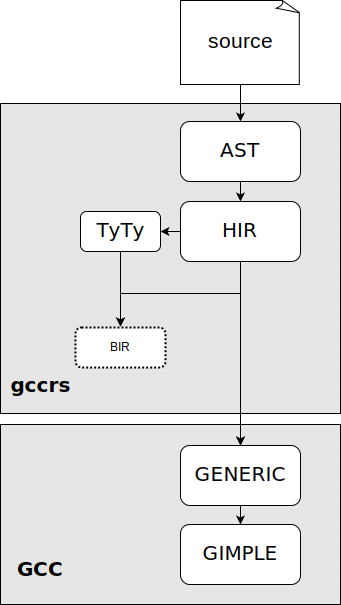

# Introduction

The first chapter introduces the problem of borrow-checking and gives a brief overview of the borrow-checker development in the `rustc` compiler, up to the Polonius project, which is utilized by this work. The second chapter describes the Polonius analysis engine and its API. The third chapter compares the internal representations of `rustc` and `gccrs` to highlight the challenges of adapting the `rustc` borrow-checker design to `gccrs`. The next chapter explains the design of the `gccrs` borrow-checker implemented as part of this work. It maps the experiments leading to the current design and describes the new intermediate representation and its usage in the analysis. Later sections of the chapter describe other modifications of the rest of the compiler necessary to support borrow-checking and the design of error reporting.
<!-- Mayby only discusses error reporting in the final chapter. -->
The final chapter elaborates on the results, the current state of the implementations, and known missing features and limitations. Since this work had an experimental nature, it focused on exploring most aspects of the problem rather than on the completeness of the solution. Therefore, the final chapter should lead to future work, extending this experimental work into a production-ready solution.

# The Problem of Borrow-Checking

This section introduces borrow-checking and briefly describes its development in Rust. First, simple lexical borrow-checking is described. Then, the more complex control-flow sensitive borrow-checking is introduced. Finally, the Polonius analysis engine is described. Since this work utilizes the Polonius engine, it is described in more detail in the following chapter.

Typical programming language implementations fall into two categories based on how they manage memory with dynamic storage duration[^bc1]. Languages like C use manual memory management, where the programmer is responsible for allocating and freeing memory explicitly. Higher-level languages like Java or Python use automatic memory management, where a garbage collector manages the memory. Since the C approach is considerably error-prone, later languages like C++ and Zig provide tools to make the deallocation of memory more implicit. For simple cases, they tie the deallocation to the destruction of other objects (RAII, smart-pointers, defer statements). What differentiates it from the stack allocation is that the relationship (called ownership) can be transferred dynamically between objects. For more complex cases, when there is no single object to that we can tie the deallocation to
(that means there are multiple objects, and the deallocation has to be linked to the destruction of the last one), they opt in for automatic memory management (reference counting). Those approaches improve the situation considerably. However, there are two problems remaining. First, those bounds can be created incorrectly, mainly in cases where the ownership of the memory is transferred between objects. The situation is even worse when two systems with different memory management tools are interfaced[^bc2]. Second, when the ownership is not transferred, but a copy of the pointer is used temporarily (we will call this "borrowing"), assuming that the owning object will exist for the whole time this copy is used. Such an assumption is often wrong, and this kind of mistake is often called a "dangling pointer."

[^bc1]: The term dynamic memory is used to refer to memory with dynamic storage duration (unknown at compile time), as opposed to memory with static duration (whole program) and memory bound to a function call (automatic storage duration).

[^bc2]: An interface between a C++ application with STL-based memory management and the Qt GUI framework, where all Qt API methods take raw pointers[^bc3]. Some of those methods assume that the ownership is transferred, and some of them do not. Those methods can only be differentiated using their documentation.

[^bc3]: As opposed to smart pointers.

The Rust language builds on the RAII approach; however, it adds a build-in static analysis called the borrow-checker to make sure that the mistakes mentioned above cannot happen. To make such analysis feasible, Rust only allows a conservative subset of memory-safe operations. Furthermore, Rust adds further limitations to ensure that memory use is safe even during multithreading execution. Because these restrictions are very strict, and they would severely limit the language, Rust provides a feature to lift some of those restrictions in clearly denoted unsafe areas. There, the responsibility for maintaining the safety invariants falls to the programmer.

<!-- TODO: I am not consistent with terminology, and I started to use the Rust one without explaining it. -->

The key idea behind Rust memory safety is to strictly (within the type system) differentiate the two problematic cases: ownership transfers and borrows. Unlike C++, Rust does not allow objects to store a reference to itself, simplifying the ownership transfer semantics (called "move" in Rust) to just a bitwise copy. For borrows, Rust uses static analysis to ensure that the lifetime of the borrowed object is longer than the lifetime of the borrow (thus avoiding dangling pointers). However, since a whole program analysis would be very expensive, Rust performs the analysis only inside of a single function and forces the programmer to formally describe the invariants of lifetimes on a single function boundary. The invariants are checked inside the function and assumed outside of the function, resulting in a safe program. This is achieved using so-called lifetime annotations. The programmer can think about a lifetime annotation as a symbol for
*some*[^bc4] set of parts (lines/expression/CFG nodes) of the program, where the reference is safe to dereference.

[^bc4]: It does not have to be unique. The borrow-checker only makes sure that some such region exists.

Let us consider the following example: We have a vector-like structure (a dynamic array), and we want to store references to integers as elements. We need to make sure that as long as the vector exists, all references stored in it are valid. However, we do not want the vector to own the integers. First, we introduce a lifetime parameter `'a`, which represents all the regions where the vector itself is alive. This parameter will be substituted at a particular use site with a concrete lifetime.

```rust
struct Vec<'a> { ... }
```

Then, for the add method, we introduce a lifetime parameter `'b`, which restricts the inserted reference. This parameter is substituted with a concrete lifetime of each reference when the method is invoked. Finally, we will require that the method can only be used with lifetimes, for which we can guarantee that `'b` is a subset of `'a` (in terms of parts of the program).

```rust

impl<'a> Vec<'a> {
    fn add<'b> where 'a: 'b (&mut self, x: &'b i32) { ... }
}
```

## The Evolution of Borrow-Checking in rustc

This section describes how the analysis evolved, gradually rejecting less memory-safe programs.
`rustc` started with lexical (scope-based analysis), followed by the first non-lexical (CFG-based) analysis, which is being extended by the Polonius project. This section strongly builds upon the RFC 2094[@rfc2094nll], which introduced the non-lexical borrow-checking to Rus. Examples from that RFC are presented in this section.

The simplest variant of borrow-checker is based on stack variable scopes. A reference is valid from the point in the program (here in terms of statements and expression) where it is created until the end of the current scope. To simplify the common programming patterns, this approach can be extended to handle some special cases. For example, when a reference is created in function parameters, it is valid until the end of the function call.

```rust
{
    let mut data = vec!['a', 'b', 'c']; // --+ 'scope
    capitalize(&mut data[..]);          //   |
//  ^~~~~~~~~~~~~~~~~~~~~~~~~ 'lifetime //   |
    data.push('d');                     //   |
    data.push('e');                     //   |
    data.push('f');                     //   |
} // <---------------------------------------+
```

[//]: # (cite the rfc)

However, a very common modification might cause the program to be rejected.

```rust
{
    let mut data = vec!['a', 'b', 'c'];
    let slice = &mut data[..]; // <-+ 'lifetime
    capitalize(slice);         //   |
    data.push('d'); // ERROR!  //   |
    data.push('e'); // ERROR!  //   |
    data.push('f'); // ERROR!  //   |
} // <------------------------------+
```

Now, there is no simple way to say when the lifetime of the reference should end to prove that his program is safe from its syntactic structure. The code above can be fixed by explicitly specifying where the lifetime should end. However, this clutters the code, and it cannot be used for more advanced cases.

```rust
{
    let mut data = vec!['a', 'b', 'c'];
    {
        let slice = &mut data[..]; // <-+ 'lifetime
        capitalize(slice);         //   |
    } // <------------------------------+
    data.push('d'); // OK
    data.push('e'); // OK
    data.push('f'); // OK
}
```

One of those more advanced cases happens when lifetimes are not symmetric in conditional branches. A typical case is when a condition checks the presence of a value. In the positive branch, we are holding a reference to the value, but in the negative branch, we do not. Therefore, it is safe to create a new reference in the negative branch.

```rust
    let mut map = ...;
    let key = ...;
    match map.get_mut(&key) { // -------------+ 'lifetime
        Some(value) => process(value),     // |
        None => {                          // |
            map.insert(key, V::default()); // |
            //  ^~~~~~ ERROR.              // |
        }                                  // |
    } // <------------------------------------+
```

For more examples, see the RFC 2094[@rfc2094nll]. However, the provided examples should be sufficient to demonstrate that analyzing the program on a control flow graph (CFG) instead of the syntactic structure (AST) allows the borrow-checker to verify much safer programs.

The above analysis thinks about lifetimes as regions (set of points in CFG) where the reference is valid. The goal of the analysis is to find the smallest regions such that the reference is not required to be valid outside of those regions. The smaller the regions, the more references can coexist at the same time, allowing more programs to be accepted.

The next generation of borrow-checking in Rust is based on the Polonius analysis engine. Polonius is an extension of NLL (non-lexical lifetimes)
which is capable of proving move programs to be safe by using a different interpretation of lifetimes.

The following code cannot be handled by NLL, but Polonius can handle it. The problem here is that everything is tied to external lifetimes (here
`'a`) has to be valid for the whole function. Since `v` is returned, it has to outlive the lifetime `'a`. However, the lifetime of `v` is bound to the lifetime of the reference to the hashmap it is stored in. It is forcing `map` to be borrowed (transitively) for at least the whole function. That includes the `map.insert` call, which needs to borrow the hashmap itself. Resulting in an error.

```rust
fn get_or_insert<'a>(
    map: &'a mut HashMap<u32, String>,
) -> &'a String {
    match HashMap::get(&*map, &22) {
        Some(v) => v,
        None => {
            map.insert(22, String::from("hi"));
            &map[&22]
        }
    }
}
```

However, we can clearly see that no variable available in the `None` branch actually uses the reference to the hashmap. This is where Polonius can help.

Instead of starting with references and figuring out where they need to be valid, Polonius goes in the other direction and tracks what references need to be valid at each point in the program. As we have determined in the example above, there is no preexisting reference to the `map` in the `None` branch.

It is important to note that only internal computations inside the compiler are changed by this. This change does not affect the language semantics. It only lifts some limitations of the compiler.

Another significant contribution of the Polonius project is the fact that it replaces many handwritten checks with formal logical rules.

# Polonius

The Polonius engine was created by [Niko Matsakis](https://github.com/nikomatsakis) and extended by [Rémy Rakic](https://github.com/lqd/) as a next-generation of control-flow sensitive borrow-checker analysis for rustc. It was designed as an independent library that can be used both by the rustc compiler and different research projects, which makes it suitable for usage in gccrs. Polonius interfaces with the compiler by passing around a struct of vectors[^pol1] of facts, where each fact is represented by a tuple of integers [^pol4] (or types convertible to integer). It is completely unaware of the compiler internals.

[^pol4]: `usize`

In the previous chapter, we have mentioned that Polonius differs from NLL in its interpretation of lifetimes. Polonius uses the term "Origin" to better describe the concept. An origin is a set of loans that can be referenced at each CFG point.

```rust
    let r: &'0 i32 = if (cond) {
            &x /* Loan L0 */
        } else {
            &y /* Loan L1 */
        };
```

> **Example:** _The origin of the reference `r` (denoted as `'0`) is the set of loans `L0` and `L1`. Note that this act is initially unknown, and it is the task of the analysis to compute it._

The engine first preprocesses the input facts. This includes a computation of transitive closures of relations and analyzing all the initialization and deinitializations that happen over the CFG. Then, it checks for move errors, i.e., when ownership of some object is transferred more than once. In the next step, liveness of variables and "outlives" graph (transitive constraints of lifetimes) are computed[@polonius2]. All origins that appear in the type of live variable are considered live.

Then Polonius needs to figure out
_active
loans_. A loan is active at a CFG point if two conditions hold. Some origin that contains the loan is live at the CFG point (i.e., there is a variable that might reference it), and the variable/place referencing the loan was not reassigned. (When a reference variable is reassigned, it points to something else.)

The compiler has to specify all the points in the CFG, where a loan being alive would violate the memory safety rules. Polonius then checks whether such a situation can happen. If it can, it reports the facts involved in the violation.

[^pol1]: A contiguous growable array type from Rust standard library. ([https://doc.rust-lang.org/std/vec/struct.Vec.html](https://doc.rust-lang.org/std/vec/struct.Vec.html))

## Polonius Facts

This section provides a list of facts taken by Polonius to give the reader a better idea of the work that needs to be done by the compiler. The facts are grouped into categories and briefly described. The full list of facts can be found in the [Polonius source code](https://github.com/rust-lang/polonius/blob/master/polonius-engine/src/facts.rs) and the Polonius Book[@polonius].

- Control flow graphs edges (`cfg_edge: (Point, Point)`).
- Facts regarding variable usage and its effects.
    - `var_used_at: (Variable, Point)` - Any usage of variable except for a drop (destructor).
    - `var_defined_at: (Variable, Point)` - Start of scope or reassignment. This reassignment treatment makes the variable act similarly to an [SSA variable](https://en.wikipedia.org/wiki/Static_single-assignment_form).
    - `var_dropped_at: (Variable, Point)` - Drop (destructor call) of the variable.
    - `use_of_var_derefs_origin: (Variable, Origin)` - Type of the variable contains the origin.
    - `drop_of_var_derefs_origin: (Variable, Origin)` - When the drop implementation used the origin.
- Facts regarding paths and their usages. Paths represent indirect or partial access to a variable (e.g., field access or cast).
    - `path_is_var: (Path, Variable)` - Lists "trivial" paths that are just a variable.
    - `child_path: (Path, Path)` - Describes hierarchical (non-transitive) relationships between paths. For example, a field path is a child path of the variable path it is accessed from.
    - `path_assigned_at_base: (Path, Point)` - Path is assigned at the CFG point. "base" means that this fact is emitted only for the exact path used, not all its parent paths.
    - `path_moved_at_base: (Path, Point)` - Ownership of origins is transferred at the CFG point.
    - `path_accessed_at_base: (Path, Point)` - Any memory access to the path (read or write).
- Facts about relationships (subset relation) of origins.
    - `known_placeholder_subset: (Origin, Origin)` - Constraints on universal origins (those representing loans that happened outside the function).
    - `universal_region: (Origin)` - List of universal origins. (See the previous point.)
    - `subset_base: (Origin, Origin)` - Any relationship between origins required by the subtyping rules.
    - `placeholder: (Origin, Loan)` - Associates an origin with a loan.
- Facts about loans.
    - `loan_issued_at: (Loan, Point)` - Result of borrow expression.
    - `loan_killed_at: (Loan, Point)` - Loan is no longer live after this point.
    - `loan_invalidated_at: (Loan, Point)` - If the loan is live at this point, it is an error.

# Comparison of Internal Representations

The execution of a borrow-checker with an external analysis engine consists of two steps. First, we need to collect the relevant information about the program. We will call that information
*facts*[^cmp1]. Second, we need to send those facts to the external engine and process them. The first step will be the focus of this and the following chapter. Before we can discuss the
_collection_ of facts itself, we need to understand how programs are represented inside the compiler. We will use the term
*internal
representation* (IR) to refer to the representation of the program inside the compiler. We will compare the IRs used by `rustc` and `gccrs` to highlight the differences between the two compilers. This will help us understand the challenges of adapting the borrow-checker design from `rustc` to `gccrs`. First, we will describe the IRs used by `rustc`, and then we will compare them with those used in `gccrs`.

[^cmp1]: This follows the terminology used by Polonius[@polonius].

## GCC vs LLVM

To understand the differences between each of the compilers, we must first explore the differences between the compiler platforms they are built on (GCC and LLVM). We will only focus on the middle-end of each platform since the back-end does not influence the front-end directly.

The core of LLVM is a three-address code (3-AD)[^comp1] representation, called the LLVM intermediate representation (LLVM IR) [@llvm, llvm-ir]. This IR is the interface between front-ends and the compiler platform (the middle-end and the back-end). Each front-end is responsible for transforming its custom AST IR into the LLVM IR. The LLVM IR is stable and strictly separated from the front-end, hence it cannot be easily extended to include language-specific constructs.

[^comp1]: Three-address code represents the program as sequences of statements (we call such sequence a
*basic
block*), connected by control flow instructions, forming a control flow graph (CFG).

{ width=75% }

[//]: # (TODO: FIX font rendering)

GCC, on the other hand, interfaces with the front-ends using a tree-based representation called the GENERIC[@gccint, p. 175]. GENERIC was created as a generalized form of AST shared by most front-ends. GCC provides a set of common tree nodes to describe all the standard language constructs in the GENERIC IR. Front-ends may define language-specific constructs and provide hooks for their handling.[@gccint, p. 212] This representation is then transformed into the GIMPLE representation, which is mostly[^gcc1] a 3-AD representation. It does so by breaking down expressions into a sequence of statements and introducing temporary variables. This transformation is done inside the compiler platform, not in the front-end. This approach makes the front-ends smaller and shifts more work into the shared part. The GIMPLE representation does not contain information specific to each front-end (programming language). However, it is possible to store language-specific information in GIMPLE by adding entirely new statements.[@gccint, p. 262] This is possible because GIMPLE is not a stable interface.

[^gcc1]: "GIMPLE that is not fully lowered is known as “High GIMPLE” and consists of the IL before the `pass_lower_cf`. High GIMPLE contains some container statements like lexical scopes and nested expressions, while “Low GIMPLE” exposes all of the implicit jumps for control and exception expressions directly in the IL and EH region trees."[@gccint, p. 225]

The key takeaway from this section is that `rustc` has to transform the tree-based representation into a 3-AD representation by itself. That means it can access the program's control flow graph (CFG). This is not the case for gccrs. In GCC, the CFG is only available in the Low GIMPLE representation, deep inside the middle-end, where the representation is already language independent.

## Rustc's Representation

In the previous section, we have seen that `rustc` is responsible for transforming the code from the raw text to the LLVM IR. Given the high complexity of the Rust language, `rustc` uses multiple intermediate representations (IRs) to simplify the process (see the diagram below). The text is first tokenized and parsed into the abstract syntax tree (AST)
and then transformed into the high-level intermediate representation (HIR). For transformation into a middle-level intermediate representation (MIR), the HIR is first transformed into a typed HIR (THIR). The MIR is then transformed into the LLVM IR.

{ width=75% }

AST is a tree-based representation of the program, closely following each source code token. At this stage, rustc performs macro-expansion and a partial name resolution (macros and imports) [@devguide [^rustc1] [^rustc2]]. As the AST is lowered to HIR, some complex language constructs are desugared to simpler constructs. For example, various kinds of loops are transformed into a single infinite loop construct (Rust `loop` keyword) and many structures that can perform pattern matching (`if let`, `while let`, `?` operator) are transformed to the `match`
construct[@reference [^rustc3]].

[^rustc1]: [https://rustc-dev-guide.rust-lang.org/macro-expansion.html](https://rustc-dev-guide.rust-lang.org/macro-expansion.html)

[^rustc2]: [https://rustc-dev-uide.rust-lang.org/name-resolution.html](https://rustc-dev-uide.rust-lang.org/name-resolution.html)

[^rustc3]: [https://doc.rust-lang.org/reference/expressions/if-expr.html#if-let-expressions](https://doc.rust-lang.org/reference/expressions/if-expr.html#if-let-expressions)

```rust
    struct Foo(i31);

    fn foo(x: i31) -> Foo {
        Foo(x)
    }
```

> This very simple code will be used as an example throughout this section.

```
Fn {
  generics: Generics { ... },
  sig: FnSig {
    header: FnHeader { ... },
      decl: FnDecl {
        inputs: [
          Param {
            ty: Ty {
                Path { segments: [ PathSegment { ident: i32#0 } ] }
            }
            pat: Pat { Ident(x#0) }
          },
        ],
        output: Ty {
            Path { segments: [ PathSegment { ident: Foo#0 } ]
        }
      },
  },
  body: Block {
    stmts: [ Stmt { Expr {
      Call(
        Expr {
            Path { segments: [ PathSegment { ident: Foo#0 } ] }
        }
        params: [
          Expr {
            Path { segments: [ PathSegment { ident: x#0 } ] }
          }
        ]
      )
    ]
  }
}
```

> This is a textual representation of a small and simplified part of the abstract syntax tree (AST) of the example program. The full version can be found in the [Appendix A](#appendix-a-ast-dump-example).

HIR is the primary representation used for most rustc operations[@devguide, HIR]. It combines a simplified version of the AST with additional tables and maps for quick access to information. For example, those tables contain information about the types of expressions and statements. These tables are used for analysis passes, e.g., the full (late) name resolution and type checking. The type-checking process includes checking the type correctness of the program, type inference, and resolution of type-dependent implicit language constructs.[@devguide [^hir2]]

[^hir2]: [https://rustc-dev-guide.rust-lang.org/type-checking.html](https://rustc-dev-guide.rust-lang.org/type-checking.html)

```rust
#[prelude_import]
use ::std::prelude::rust_2015::*;
#[macro_use]
extern crate std;
struct Foo(i32);

fn foo(x: i32) -> Foo { Foo(x) }
```

> One of HIR dump formats: HIR structure still corresponds to a valid Rust program, equivalent to the original one. `rustc` provides a textual representation of HIR, which displays such a program.

The HIR representation can contain many placeholders and "optional" fields that are resolved during the HIR analysis. To simplify further processing, parts of HIR that correspond to executable code (e.g., not type definitions) are transformed into THIR
(Typed High-Level Intermediate Representation) where all the missing information must be resolved. The reader can think about HIR and THIR in terms of the builder pattern[^hir1]. HIR provides a flexible interface for modification, and THIR the final immutable representation. This involves not only the data stored in HIR helper tables but also parts of the program that are implied from the type system. That means that operator overloading, automatic references, dereferences, etc., are all resolved into explicit code at this stage.

[^hir1]: [https://en.wikipedia.org/wiki/Builder_pattern](https://en.wikipedia.org/wiki/Builder_pattern)

The final `rustc` IR, which is lowered directly to the LLVM IR, is the Mid-level Intermediate Representation (MIR). We will pay extra attention to MIR because it is the primary representation used by the borrow-checker. MIR is a three-address code representation, similar to LLVM IR but with Rust-specific constructs. It contains information about types, including lifetimes. It differentiates pointers and references, as well as mutable and immutable references. It is aware of panics and stack unwinding. It contains additional information for borrow-checker, like storage live/dead annotations, which denote when a place is first used or last used, and false operations, which help with the analysis. For example, a false unwind operation inside infinite loops ensures an exit edge in the CFG. This can be critical for algorithms that process the CFG in reverse order.

MIR consists of sequences of statements (basic blocks) connected by control flow instructions. This structure forms a control flow graph. MIR statements operate on places and rvalues. A place (often called lvalue in other languages) is an abstract representation of a memory location. It is either a local variable or a value derived the variable (e.g., a field, an index, cast).

Rustc also uses a special IR, called the TyTy, to represent types. Initially, types are represented in HIR on a syntactic level. Every mention of a type in the program compiles into a distinct HIR node. These HIR nodes are compiled into the TyTy representation during the analysis of HIR. Each type (all of its occurrences in the program) is represented by a single TyTy object instance. This is achieved by interning. Note that there can be multiple equivalent types of different structures. Those are represented by different TyTy instances. Each non-primitive type forms a tree (e.g., reference to a pair of an integer and a character), where the inner nodes are shared (due to interning). Generic types, which are of a particular interest to borrow-checking, are represented as a pair:
an inner type and a list of generic arguments. When generic type parameters are substituted for concrete types, the concrete type is placed into the argument list. The inner type is left unchanged. When the type substitution is complete, there is a procedure that transforms the generic type into a concrete type.

Inside the HIR, after the type-checking analysis, TyTy types of nodes can be looked up based on the node's ID in one of the helper tables
(namely, the type-check context). Each `THIR` node directly contains a pointer to its type. In MIR, the type is stored inside each place.

```rust
fn foo(_1: i32) -> Foo {
    debug x => _1;
    let mut _0: Foo;	

    bb0: {
        _0 = Foo(_1);
        return;
    }
}
```

> MIR dump example: For further details, see the [Source Code Representation]() chapter of the rustc developer guide.

## Rust GCC representation

> This section discusses intermediate representations in gccrs. Since gccrs is a second implementation of the Rust compiler, it is heavily inspired by rustc. Therefore, this section assumes familiarity with rustc's intermediate representations, described in the previous section. We will focus on similarities and differences between rustc and gccrs, rather than describing the gccrs intermediate representation in full detail.

The gccrs representation is strongly inspired by rustc and diverges mostly for two reasons: for simplicity since gccrs is still in an early stage of development and due to the specifics of the GCC platform. Gccrs uses its own variants AST, HIR, and TyTy representations but does not use THIR or MIR.

AST and HIR representations are similar to `rustc`'s, with fewer features supported. The main difference is the structure of the representation. Rustc takes advantage of algebraic data types, resulting in very fine-grained representation. On the other hand, gccrs is severely limited by the capabilities of C++11 and is forced to use an object-oriented approach.

There is no THIR and MIR or any equivalent in gccrs. MIR cannot be used in GCC unless the whole `gccrs` code generation is rewritten to output (low) GIMPLE instead of GENERIC, which would be way more complex than the current approach. Given the limited development resources of gccrs, this is not a viable option. [@zulip]

TyTy type representation is simplified in `gccrs` and provides no uniqueness guarantees. There is a notable difference in the representation of generic types. Instead of being built on top of the types (by composition) like in `rustc`, types that support generic parameters inherit from a common base class. That means the type definition is not shared between different generic types. The advantage of this approach is that during the substitution of generic parameters, the inner types are modified during each substitution, simplifying intermediate handling, like type inference. [todo, ask Phillip if this is true]

# Rust GCC Borrow-checker Design

The Rust GCC borrow-checker is designed to be as similar to the `rustc` borrow-checker as possible withing the constraints of the Rust GCC. This allows us to leverage the existing knowledge about borrow-checking in Rust. The analysis works in two phases. First, it collects relevant information (called facts) about the program, which takes a form of tuples of numbers. Then it passes the facts to the analysis engine, which computes the results of the analysis. The compiler then receives back the facts involved in memory safety violations and translates them into error messages. The main decision of the Rust GCC borrow-checker is to reuse the analysis engine from rustc. To connect the Polonius engine written in Rust to the gccrs compiler written in C++, we use the C ABI and a thin Rust wrapper.

This chapter describes the process of designing the gccrs borrow-checker, the decisions made during the process and the final design. Special emphasis is placed on a new borrow-checker intermediate representation (BIR) and its usage in the analysis. The chapter also describes other modifications of the compiler necessary to support borrow-checking. The final section briefly describes the design of error reporting.

## Analysis of the Fact Collection Problem

This section described options for fact collection in gccrs that were considered and experimented with during the initial design phase. Due to the differences between internal representations of rustc and gccrs, it was impossible to simply adopt the rustc's approach. Considered options were to use HIR directly, to implement MIR in gccrs, or to design a new IR for borrow-checking with multiple options to place it inside the compilation pipeline.

The analysis has been control-flow sensitive since NLL's introduction in rustc (see section [2.1](#the-evolution-of-borrow-checking-in-rustc)), requiring us to match the required facts, which are specific to Rust semantics, with control-flow graph nodes. We need to distinguish between pointers (in unsafe Rust) and references. Pointer is not subject to borrow-checking, but references are. Furthermore, we need to distinguish between mutable and immutable references since they have different rules, which is essential for borrow-checking[^afcp1]. Each type must carry information about its lifetimes and their variances (described later in this chapter). We need to store the explicit lifetime parameters from explicit user type annotation.

The only IR in GCC that contains the CFG information is GIMPLE; however, under normal circumstances, GIMPLE is language agnostic. It is possible to annotate the GIMPLE statements with language-specific information, using special statements, which would have to be generated from special information that would need to be added GENERIC. The statements would need to be preserved by the middle-end passes until the pass building the CFG (that includes 11 passes), after which the facts could be collected. After that, the facts would need to be discarded to avoid complicating the tens of following passes[^afcp2][@gccint, p. 141] and RTL generation. This approach was discussed with senior GCC developers and quickly rejected as it would require a large amount of work, and it would leak front-end specific information into the middle-end, making it more complex. No attempt was made to experiment with this approach.

[^afcp1]: The critical rule of borrow-checking is that for a single borrowed variable, there can only be a single mutable borrow or only immutable borrows valid at each point of the CFG.

[^afcp2]: See file `gcc/passes.def` in the GCC source code.

It was clear that we needed to build a GFC. Luckily, working with a particular control flow graph created by the compiler is unnecessary. Any CFG that is consistent with Rust semantics is sufficient. In particular, adding any edges and merging nodes in the CFG is conservative with regard to the borrow-checking analysis in many cases does not change the result. The rustc exploits this fact in at least two ways. `match` expression CFG is simplified[citation needed], and fake edges are added to loops to ensure an exit edge[citation needed].

Initially, We have tried to collect the information from the HIR directly and compute an approximate CFG on the fly. That worked nicely for simple language constructs that are local, but it gets very complicated for more complex constructs like patterns, loops with `break` and `continue` statements. Since no representation is generated, there is no easy way to verify the process, not even by manual checking. Furthermore, it was not clear how to handle panics and stack unwinding in this model.

An option to ease such problems was to radically desugared the HIR to only basic constructs. An advantage of this approach is that it would leverage the code already existing in the code generator, making the code generation easier. Also, the code generator already performs some of those transformations locally
(not applying them back to HIR, but using them directly for GENERIC generation), so hose could be reused. The problem that quickly arose was that the HIR visitor system was not designed for HIR-to-HIR transformations, where new nodes would be created. Many such transformations, like explicit handling of automatic referencing and dereferencing, would require information about the type of each node, which would, in return, require name resolution results. Therefore, that transformation would have to happen after all analysis passes on HIR are completed. However, all information stored alongside HIR would need to be updated for each newly created node. The code generator partly avoids this problem by querying the GENERIC API for the information it needs about the already compiled code. This fact would complicate leveraging of the existing transformations on the HIR to HIR level. Rustc avoids this problem by doing such transformations on the HIR-THIR boundary and not modifying the HIR itself. Since this modification would be complicated, and it would only be a preparation for the borrow-checking, it was decided not to proceed in this direction at that time. However, we found that some transformation can be done on the AST-HIR boundary. This approach can be done mostly independently (only code handling the removed nodes is also removed, but no additions or modifications are needed). It was agreed that such transformations are useful and should be implemented regardless of the path taken by the borrow-checker. Those transformations include mainly loops and pattern-matching structures. Those transformations are even documented in the rust reference [@reference][citation needed].

> At the time of writing this thesis, desugaring of the for loop was implemented by Philip Herron.
> More desugaring work is in progress or planned.
> However, I have focused on the borrow-checking itself. For the time being, I have ignored the complex constructs, assuming that they will be
> eventually desugared to constructs that borrow-checker already can handle.

To ensure all possible approaches were considered, we have discussed the possibility of implementing MIR in gccrs. This approach has some advantages and many problems. Should the MIR be implemented in a completely compatible way, it would be possible to use tools like MIRI[ref needed] with gccrs. The borrow-checking would be very similar to rustc's borrow-checking, and parts of rustc's code might even be reused. Gccrs would also be more ready for Rust-specific optimizations. The final advantage is that the current test suite would cover the process of lowering HIR to MIR, as all transformations would affect the code generation. The main problem with this approach is that it would require a large portion of gccrs to be reimplemented, delaying the project by a considerable amount of time. Should such an approach be taken, any effort on borrow-checking would be delayed until the MIR is implemented. It was decided by the maintainers[@zulip] that such an approach is not feasible and that gccrs will not use MIR in any foreseeable future.

After Arthur Cohen suggested keeping things simpler, I decided to experiment with a different, minimalistic approach—to build a radically simplified MIR-like IR that keeps only the bare minimum of information needed for borrow-checking. Given the unexpected productivity of this approach, it was decided to go on with it. This IR, later called the borrow-checker IR (BIR), only focuses on the flow of data, and it ignores the actual operations. The main disadvantage of this approach is that it creates a dead branch of the compilation pipeline that is not used for code generation, and therefore, it is not covered by the existing test suite. To overcome this difficulty, the BIR and its textual representation (dump) are designed to be as similar to rustc's MIR as possible. This allows us to check the generated BIR against the MIR generated by rustc, at least for simple programs. This is the final approach used in this work. Details of the BIR design are described in the next section.

{ width=35% }

## The Borrow-Checking Process

Before the borrow-checking itself can be performed, specific information about types needs to be collected when HIR is type-checked and TyTy types are created and processed. The TyTy needs to resolve and store information about lifetimes and their constraints. At this point, lifetimes are resolved from string names, and their bounding clauses are found. There are different kinds of lifetimes that can be encountered. Inside types, the lifetimes are bound to the lifetime parameters of generic types. In function pointers, lifetimes can be universally quantified (meaning that the function must work for every possible lifetime). In function definitions, lifetimes can be elided when all references have the same lifetime. In function bodies, lifetimes can be bound to the lifetime parameters of the function, or they can be omitted, in which case they are inferred
[^bp1].

_**TODO**build bir_

_**TODO**collect facts_

_**TODO**ffi polonius_

_**TODO**run the analysis_

_**TODO** receive results_

[^bp1]: At least Rust semantics thinks about it that way. In reality, the compiler only checks that there exists some lifetime that could be used in that position by collecting constraints that would apply to such a lifetime and passing them to the borrow-checker.

## Borrow-checker IR Design

The borrow-checker IR (BIR) is a three-address code representation designed to be close to a subset of rustc's MIR. Same as MIR, it represents the body of a single function (or other function-like item, e.g., a closure) since borrow-checking is performed on each function separately. It ignores particular operations and merges them into a few abstract operations focusing on data flow.

```rust
fn fib(_1: usize) -> i32 {
    bb0: {
        _4 = Operator(_1, const usize);
        switchInt(_4) -> [bb1, bb2];
    }

    ... 

    bb6: {
        _8 = Operator(_1, const usize);
        _9 = Call(fib)(_8, ) -> [bb7];
    }

    bb7: {
        _10 = Operator(_7, _9);
        _2 = _10;
        goto -> bb8;
    }

    bb8: {
        _0 = _2;
        return;
    }
}
```

> A shortened example of a BIR dump of a simple Rust program. The program computes the n-th Fibonacci number.
> The source code, full dump, and legend can be found in the [
_appendix
C_](#appendix-c-bir-dump-example).
> This example comes from a "BIR Design Notes," which is part of the source tree and where provides an introduction for a developer getting familiar with the basic aspects of the borrow-checker implementation.

The BIR of a single function is composed of basic metadata about the function (like arguments, return type, explicit lifetimes, etc.), a list of basic blocks, and a list of places.

A basic block is identified by its index in the function's basic-block list. It contains a list of BIR statements and a list of successor basic block indices in the CFG. BIR statements are of three categories: An assignment of an expression to a local (place), a control flow operation (switch, return), or a special statement (not executable), which carries additional information for the borrow-checker (explicit type annotations, information about variable scope, etc.). BIR statements correspond to the MIR `StatementKind` enum.

Expressions represent the executable parts of the rust code. Many different Rust contracts are represented by a single expression, as only data (and lifetime) flow needs to be tracked. Some expressions are differentiated only to allow for a better debugging experience. BIR expressions correspond to the MIR `RValue` enum.

Expressions and statements operate on places. A place is an abstract representation of a memory location. It is either a variable, a field, an index, or a dereference of another place. For simplicity, constants are also represented as places. Since exact values are not important for borrow-checking and constants are, from principle, immutable with static storage duration, a single place can represent all constants of a single type. Rustc MIR cannot afford this simplification, and it keeps constants separate. The `Operand` enum is a common interface for places and constants. However, since operations use constants and lvalues the same way, MIR introduces a special layer of lvalues.

Places are identified by the index in the place database. The database stores a list of places and their properties. The properties include an identifier, used to always resolve the same variable (field, index, etc.) to the same place, move and copy flags, type, a list of fresh regions (lifetimes), and a relationship to other places (e.g., a field of a struct). Temporaries are treated just like variables but are differentiated in the place database because of place lookup. The place database structure is based on rustc `MovePathData`[^bir1]. It combines the handling of places done by both MIR and borrow-checker separately in rustc.

[^bir1]: [https://rustc-dev-guide.rust-lang.org/borrow_check/moves_and_initialization/move_paths.html](https://rustc-dev-guide.rust-lang.org/borrow_check/moves_and_initialization/move_paths.html)

It is important to highlight that different fields are assigned to different places; however, all indices are assigned to the same place (both in gccrs and rustc). That has a strong impact on the strength and complexity of the analysis, since the number of fields is static and typically small, the size of arrays is unbound and depends on runtime information.

The following graphic illustrates the whole structure of BIR:

[TODO: current latex template does not allow enough nesting]

- `BIR Function`
    - basic block list
        - basic block
            - `Statement`
    - place database
    - arguments
    - return type
    - universal lifetimes
    - universal lifetime constraints

- `Statement`
    - `Assignment`
        - `InitializerExpr`
        - `Operator<ARITY>`
        - `BorrowExpr`
        - `AssignmentExpr` (copy)
        - `CallExpr`
    - `Switch`
    - `Goto`
    - `Return`
    - `StorageLive` (start of variable scope)
    - `StorageDead` (end of variable scope)
    - `UserTypeAsscription` (explicit type annotation)

## BIR Building

The BIR is built by visiting the HIR tree of the function. There are specialized visitors for expressions and statements, patterns, and a top-level visitor that handles function headers (arguments, return, lifetimes, etc.). Whenever a new place is created in the compilation database, a list of fresh regions[^bir2] is created for it. At this point, we need to figure out the number of lifetimes mentioned in a type. For basic types, this is achieved by traversing the type and counting the number of lifetime parameters. For generic types, the inner structure is ignored, and only the lifetime and type parameters are considered. Note that the type parameters can be generic, creating a structure known as higher-kinded[ref here] lifetimes. This counting is performed (as a side product) during the variance analysis (explained below) to simplify the type traversing code. All types are independently queried for each node from HIR (they are not derived inside the BIR).

[^bir2]: In this text, I use the term lifetime for the syntactic object in the code and region for the semantic object in the analysis. It is called a region because it represents a set of points in the control flow graph (CFG). At this point, the set is not yet known. It is the main task of the borrow-checker analysis engine to compute the set of points for each region.

> Example: For a BIR code that reads a field from a variable, the type is not computed from the variable. Rather, it is queried from the HIR for both the variable and the field.

BIR building itself is fairly straightforward. However, some extra handling was added to produce a code that is more similar to `rustc`'s MIR. For example, instead of eagerly assigning computed expressions to temporaries, it is checked whether the caller did not provide a destination place. This removes some of the `_10 = _11` statements from the BIR dump.

> This handling was especially important when testing the initial BIR builder since it makes the dump more similar to the MIR dump and, therefore, easier for manual comparison.

## BIR Fact Collection and Checking

The BIR fact collection extracts the Polonius facts from the BIR and performs additional checks. Polonius is responsible for checking lifetime (region) constraints, moves, and conflicts between borrows. For lifetimes, it checks that the constraints are satisfied and that all required constraints are present in the program. For moves, it checks that each place is moved at most once. For borrows, it checks that any two conflicting borrows (e.g., two mutable borrows of the same place) are not alive at the same time. Sets of conflicting borrows have to be supplied to Polonius manually. The borrow-checker itself is responsible for violations that are not control-flow sensitive, like modification of an immutably borrowed place or moving from behind a reference.

The fact collection is performed in two phases. First, static facts are collected from the place database. Those include copying of universal region constraints (constraints corresponding to lifetime parameters of the function)
Moreover, collected facts from the place database. Polonius needs to know which places correspond to variables and which form paths (see definition below). Furthermore, it needs to sanitize fresh regions of places that are related (e.g., a field and a parent variable) by adding appropriate constraints between them. Relations of the region depend on the variance of the region within the type. (See Variance Analysis below.)

```rust
Path = Variable
     | Path "." Field // field access
     | Path "[" "]"   // index
     | "*" Path
```

> Formal definition of paths from the Polonius book.

In the second phase, the BIR is traversed along the CFG, and dynamic facts are collected. For each statement, two CFG nodes are added to the Polonius-specific representation of the CFG. For each statement. This is needed to model the parts of semantics, where the statement takes effect after the statement is executed. For each statement, there is a CFG node corresponding to the state of the program before and after the statement is executed. For each statement and (if present) its expression, Polonius facts are collected. Those include generic facts related to read and write operations, as well as facts specific to borrows and function calls. For the function, we need to instantiate fresh regions for the function's lifetime parameters, which need to be correctly bound together.

### Subtyping and Variance

In the basic interpretation of Rust language semantics (one used by programmers to reason about their code, not the one used by the compiler), lifetimes are part of the type and are always present. If a lifetime is not mentioned in the program explicitly, it is inferred the same way as a part of type would be
(e.g. `let a = (_, i32) = (true, 5);` completes the type to `(bool, i32)`) Note, It is actually impossible to write those lifetimes. In the Rust program, all explicit lifetime annotations are so-called universal and correspond to any borrow that happened **outside** the function, and therefore, it is alive for the whole body of the function. Explicit lifetime annotations corresponding to regions spanning only a part of the function body would be pointless, since those regions are precisely determined by the code itself, and there is nothing to further specify. Explicit lifetimes annotations are only used to represent constraints following from code that the borrow-checker cannot see.

Let us make an example. In the example, we need to infer the type of x, such that it is a subtype of both `&'a T` and `&'b T`. We need to make sure, that if we further use x, that is safe with regard to all loans[^var1]that it can contain (here `a` or `b`).

[^var1]: Loan is the result of borrow operation.

```rust
let mut x;
if (b) {
    x = a; // a: &'a T
} else {
    x = b; // b: &'b T
}
```

In Rust, unlike in dynamic languages like Java, the only subtyping relation other than identity is caused by lifetimes[^var3]. Two regions (corresponding to lifetimes) can be either unrelated, a subset of each other (in terms of a set of CFG nodes) (denoted `'a: 'b`), or equal (typically a result of `'a: 'b` and `'b: 'a`). The dependency of subtyping on the inner parameter is called variance.

[^var3]: During the type inference computation, there can also be subtyping relation with a general kind of type like <integer>, which is mostly used for not annotated literals, where we know it is some kind of integer, but we do not yet know which one

> `F<T>` is covariant over `T` if `T` being a subtype of `U` implies that `F<T>` is a subtype of `F<U>` (subtyping "passes through")
>
> `F<T>` is contravariant over `T` if `T` being a subtype of `U` implies that `F<U>` is a subtype of F<T>
>
> `F<T>` is invariant over `T` otherwise (no subtyping relation can be derived)
>
> [@reference]

Let us see what that means on an example specific to lifetimes. For a simple reference type `&'a T`, the lifetime parameter `'a` is covariant. That means that if we have a reference `&'a T` we can coerce it to
`&'b T`, then `'a` is a subtype of `'b`. In other words, if we are storing a reference to some memory, it is sound to assign it to a reference that lives for a shorter period of time. That is if it is safe to dereference a reference within any point of period `'a`, it is also safe to dereference it within any point of period `'b`, (`'b` is subset of `'a`) [^var2].

[^var2]: A subset of CFG nodes.

The situation is different when we pass a reference to a function as an argument. In that case, the lifetime parameter is contravariant. For function parameters, we need to ensure that the parameter lives as long as the function needs it to. If we have a function pointer of type `fn foo<'a>(x: &'a T)`, we can coerce it to `fn foo<'b>(x: &'b T)`, where `'b` lives longer than `'a`.

Let us look at that visually. In the following code, we have region `'a` where it is saved to reference the storage of `x`, and region `'b` where it is safe to reference the storage of `y`. If a function safely works with a reference of lifetime `'b` it will also safely work with a reference of lifetime `'a`. Hence, we can "pretend" (understand: coerce) what `fn(&'b T)` is `fn(&'a T)`.

```rust
let x = 5;        | region 'a
{                 |
    let y = 7;    |             | region 'b          
}                 |
```

The return type of function is effectively an assignment to a local variable (just across function boundaries) and, therefore, is covariant.

The situation gets interesting when the two rules are combined. Let us have a function `fn foo<'a>(x: &'a T) -> &'a T`. The return type requires the function to be covariant over `'a`, while the parameter requires it to be contravariant. This is called
*invariance*.

For non-generic types, its variance immediately follows from the type definition. For generic types, the situation is more complex.

### Variance of Generic Types

There are multiple approaches to the variance of generic types. It can be either derived from the usage of the type or its definition[@Altidor2011]. For non-generic types, use-site variance is used.[^gvar1]
For generic types, Rust uses definition-site variance. That means that the variance is computed solely from the definition of the type (effectively, usage constraint to the body of the type), not from its usage (inside functions). The situation gets complicated when a generic type is used inside another generic type, possibly even in a recursive fashion. In that situation, the variance has to be computed using a fix-point algorithm (further referred to as "variance analysis").

[^gvar1]: For `&'a T`, if the reference is used as a function parameter, it is contravariant; if it is used as a return type, it is covariant.

#### Variance Analysis

Both rustc and `gccrs` variance analysis implementation is based on Section 4 of the paper @Altidor2011. Notation from the paper is followed in the documentation of both compilers, their documentation and in this text. The paper primarily focuses on complex type variance, like in the case of Java, but it introduces an effective formal calculus, which works nicely with higher-kinded lifetimes.

The exact rules are best understood from the paper and from the code itself. Therefore, I will only provide a simple overview here.

The analysis uses an iterative fixed-point computation, where variables form a semi-lattice with an additional binary operation. A single variable corresponds to a single lifetime or type parameter. Variables are initialized as bivariant.

The visitor traverses each type with the current variance of the visited expression as an input. Each member of a type is in a covariant position. Each member of a function parameter is in a contravariant position. The return type is in the covariant position. The generic argument position is determined by the variance of the generic parameter (a variable of this computation). The variance of the current node within the type is computed by the `transform` function, taking the variance of the parent node and the variance based on the position of the current node and building and expression. When a lifetime or type parameter is encountered, then, if the current variance expression is constant, the variable is updated to the new variance using the join operation with the current value. For an expression containing at least one variable, the expression is added to the list of constraints. Here, the fixed-point computation requirement arises.

Once all types in the crate are processed, the constraints are solved using a fixed-point computation. Note that the current crate can use generic types from other crates, and therefore, it has to export/load the variance of public types.

##### Example of Algorithm Execution

```rust
struct Foo<'a, 'b, T> {
    x: &'a T,
    y: Bar<T>,
}
```

- Struct foo has three generic parameters, leading to 3 variables. `f0=o`, `f1=o` and `f2=o`.
- `x` is processed first, in covariant position.
    - `&'a T` is in covariant position, therefore variables are updated to `f0=+` and `f2=+`.
- `y` is processed second, in covariant position.
    - `Bar<T>` is in covariant position.
        - `T` is inside a generic argument, therefore, its position is computed as a term `transform(+, b0)`.
            - New constant `f2 = join(f2, transform(+, b0))` is added.
- All types are processed. Let us assume that `Bar` is an external type with variances `[-]`  Now a fixed-point computation is performed.
    - Iteration 1:
        - Current values are `f0=+`, `f1=o` and `f2=+`
        - Processing constraint `f2 = join(f2, transform(+, b0))`
        - `transform(+, b0)` where `b0=-` yields `-`
        - `join(+, -)` yields `*`
        - `f2` is updated, therefore, another iteration is needed.
    - Iteration 2:
        - Current values are `f0=+`, `f1=o` and `f2=*`
        - Processing constraint `f2 = join(f2, transform(+, b0))`
        - `transform(+, b0)` where `b0=-` yields `-`
        - `join(*, -)` yields `*`
        - `f2` is not updated, therefore, the computation is finished.
- The final variance is `f0=+`, `f1=o` and `f2=*`:
    - `f0` is evident,
    - `f1` stayed bivariant, because it was not mentioned in the type,
    - `f2` is invariant, because it s is used in both covariant and contravariant position.

## Representation of Lifetimes in TyTy

> The term _lifetime_ is used in this work to refer to the syntactic object in HIR and AST. In the source code it corresponds to either explicit universal[^lifetimes] lifetime annotation (`'a`), elided universal lifetime annotation[@reference](https://doc.rust-lang.org/reference/lifetime-elision.html), and local/existential[^lifetimes] lifetimes, which are always inferred. In contrast, _region_/_origin_ is used to refer to the semantic object. The object is in fact an inference variable, and its value is computed by the borrow-checker. The term _region_ is used by NLL to referer to a set of CFG points. Polonius introduced the term _origin_ to refer to a set of _loans_. In this text and the implementation, we use the two terms interchangeably.

[^lifetimes]: There are two kinds of lifetimes in Rust semantics: universal and existential. Universal lifetimes corresponds to code that happens outside the function. It is called universal, because in the borrow-checker rules, it is universally quantified. That means that the function has to be valid _for all_ possible outside code that satisfies the specified (or implied) constraints. Existential lifetimes corresponds to code that happens inside the function. It is called existential, because in the borrow-checker rules, it is existentially quantified. That means that the code has to be valid _for some_ set of _loans_ (or CFG points). [TODO: should this be here?]

In order to analyze more complex lifetimes than just simple references, it was necessary to add representation of lifetime parameters to the type system and unify it with the representation of lifetimes in the rest of the compiler. The first step is to resolve the lifetimes and bind them to their bounding clauses. Gccrs recognizes four kinds of regions. In a function body, explicit lifetimes annotations result in "named" lifetime and implicit lifetimes annotations result in "anonymous" lifetimes. Within generic data types lifetimes resolved to lifetime parameters are called "early-bound." For function pointers and traits, lifetimes can be universally quantified using the `for` clause[^tyty1]. Those lifetimes are not resolved when the definition is analyzed but only when this type is used. Hence, the name is "late-bound" lifetimes. In addition, there is a representation for unresolved lifetimes. It is used, for example, when a generic type is defined, but the generic arguments have not been provided yet. Any occurrence of an unresolved lifetime after type checking it to be treated as a compiler bug.

[^tyty1]: `for<'a> fn(&'a i32) -> &'a i32`

Inside TyTy, lifetimes are represented in the following ways. Named lifetimes are enumerated. Anonymous lifetimes are assumed to be always distinct (but they are represented the same at this stage). Early bound lifetimes are represented by the relative position of the lifetime parameter it is bound to. In generic types, the lifetime arguments are stored together with the type arguments, which ensures their automatic propagation. One issue with this automatic propagation is that the bindings of early bound lifetimes are updated. That means that by a simple inspection of the body of the generic type, one would not be able to resolve the lifetimes. This is resolved by a trick. Each TyTy type is identified by an id. When generic arguments are substituted, a clone of the type with a fresh id is created. What we would like to achieve is to have the same state that is in rustc: the original body and up-to-date list of generic arguments. This can be achieved by storing the id of the original type in addition to the current id, and it can be looked up when needed[^dream]. The analysis can then traverse the original type, and when a type placeholder is encountered, the appropriate argument is looked up in the current type.

[^dream]: This was once revealed to me in a dream.

## Error Reporting

[_**TODO** this is kinda mixed with the next chapter_]

As each function is analyzed separately, the compiler can easily report which functions violate the rules. Currently, only the kind of violation is communicated from the Polonius engine to the compiler. More detailed reporting is an issue for future work.

There are three possible ways the more detailed reporting could be implemented.

The first is to pass all the violations back to the compiler to be processed as a return value of the Polonius FFI invocation. This variant provides a simple separation of roles between the compiler and the analysis engine; However, it might be difficult to implement correctly with regard to memory ownership around the FFI boundary, since Polonius would need to allocate dynamically sized memory to pass the result. Polonius would need to implement a special API to release the memory.

The second variant is to pass a callback function for reporting the found errors to the Polonius engine, which would be called for each violation. However, Polonius only has information in terms of the enumerated nodes of the control flow graph. Therefore, a pointer to an instance of the borrow checker would need to be passed to the Polonius engine to be used in combination with the callback to resolve the nodes to the actual code. The separation of roles, where Polonius and Polonius FFI are used just as external computation engines, is broken.

A compromise between these variants would be to provide Polonius with callback functions, which would send the violations to the compiler one by one, leaving the allocation on the compiler side only.

Moreover, the borrow-checker currently does not store information to map the nodes back to source code locations. This issue is clearly technical only, and the functionality can be added easily with local changes only. Since this work has an experimental character, work on the analysis itself was prioritized over more detailed error reporting.

The final stage of the borrow-checker development would be to implement heuristics to guess the sources of the error and suggest possible fixes.

# Current State

[_**TODO**very much todo, don't even read this_]

## Kind of Detected Errors

## Parsing

Parsing handles both explicit and implicit lifetimes correctly.

Parsing of special lifetimes (`'static` and `'_`) was fixed. Handling of implicit lifetimes was added.

## AST to HIR Lowering

## Type Checking (TyTy Representation)

The resolution of named lifetimes to their binding clauses was added. `TyTy` types were refactored from the usage of named lifetimes to resolved regions. Previously, the handling of lifetimes in generic types was completely missing, and the representation of regions inside generic types was added. Also, a mechanism to map original types to substituted ones, preserving information about parameter position, was added.

## Borrow-checker Scheduling

## BIR Building

### BIR Dump

## BIR Fact Collection

## Polonius FFI

## Error Reporting

# References

::: {#refs}
:::

#                                      

# Appendix A: AST Dump Example

```rust
// TODO need to figure out fot ti fit in nicely in the pdf
```

# Appendix B: HIR Dump Example

```rust
// TODO
```

# Appendix C: BIR Dump Example

```rust
// TODO
```

# Appendix D: Examples of Caught Errors

```rust
// TODO
```