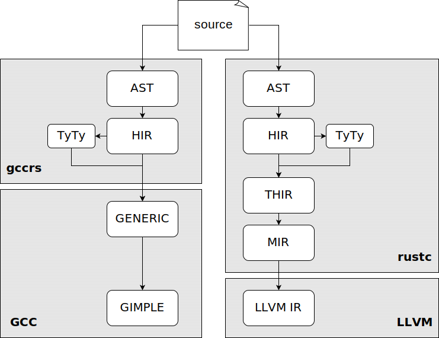
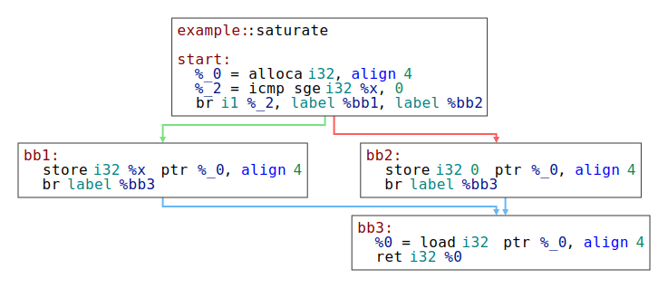

t---
title: Memory Safety Analysis in Rust GCC
author: Jakub Dupak
---

# Introduction

The first chapter introduces the problem of borrow-checking and gives a brief overview of the borrow-checker development in the `rustc` compiler, up to the Polonius project, which is utilized by this work.
The second chapter describes the Polonius engine and its API.
The third chapter compares the internal representations of `rustc` and `gccrs` to show the challenges of adapting the `rustc` borrow-checker design to `gccrs`.
The next chapter explains the design of the `gccrs` borrow-checker implemented as part of this work.
It maps the experiments leading to the current design, describes the new intermediate representation and its usage in the analysis.
Later sections of the chapter describe other modification of the rest of the compiler necessary to support borrow-checking, and the design of error reporting.
The final chapter elaborates on the results, current state of the implementations and known missing features and limitations.
Since this work had an experimental nature, it focused on exploring the most aspects of the problem, rather than on the completeness of the solution.
Therefore, the final chapter should lead the future work, extending this experimental work into a production-ready solution.

# The Problem of Borrow-Checking

This section introduces borrow-checking and briefly describes its development in Rust. First, simple lexical borrow-checking is described.
Then, the more complex flow-sensitive borrow-checking is introduced.
Finally, the Polonius analysis engine is described.
Since this work utilizes the Polonius engine, it will be described in more detail in the following chapter.

Common programming language implementations typically fall into two categories, based on how they manage memory with dynamic storage duration[^bc1].
Languages like C use manual memory management, where the programmer is responsible for allocating and freeing memory explicitly.
Higher-level languages like Java or Python use automatic memory management, where the memory is managed by a garbage collector.
Since the C approach is extremely error-prone, later languages like C++ and Zig provide tools to make the deallocation of memory more implicit.
For simple cases, they tie the deallocation to destruction of other objects (RAII, smart pointers, defer statements).
Unlike with stack-based allocation, this relationship (called ownership) can be transferred dynamically between objects.
For more complex cases,
when a there is no single object that we can tie the deallocation to
(that means, there are multiple object and the deallocation has to be tied to to destruction of the last object),
they opt in for automatic memory management (reference counting).
Those approaches improve the situation, there are still two problems remaining.
First, those bounds can be created incorrectly, especially in cases where the ownership of the memory is transferred between different objects.
Especially, when two systems with different memory management tools are interfaced[^bc2].
Second, when the ownership is not transfered, but a copy of the pointer is used teporarily (borrowed),
assuming, that the owning object will exist for the whole time this copy is used.
This assumption is often wrong.

The Rust language build on the RAII approach, however it adds a build-in static analysis tool,
called the borrow-checker, to make sure that the mentioned mistakes do not happen.
To make such analysis feasible, Rust only allows a conservative subset of operations, for which the analysis is feasible.
Furthermore, Rust adds limitations to make the memory use safe even during multithreading execution.
Bacause the restrictions are very strict and they would severely limit the language,
Rust provides a tool to lift some of those restrictions in clearly denoted unsafe areas,
where the responsibility of the memory invariants falls to the programmer.

The key idea is that Rust strictly (within the type system) differentiates the two problematic cases: ownership transfers and borrows.
Unlike C++, Rust does not allow objects to store a reference to itself, simplify the ownership transfer semantics (move), to just a bitwise copy.
For borrows, Rust uses static analysis,
to ensure that the lifetime of the borrowed object is longer than the lifetime of the borrow (thus avoiding dangling pointers).
Since a whole program analysis would be very expensive,
Rust performs the analysis only for a single function, and forces the programmer,
to formally describe invariants of reference lifetimes on the function boundary.
The invariants are checked inside the functions and assumed outside of the function, resulting in a safe program.
Particularly, Rust requires the programmer to conservatively describe the relationships of lifetimes of all objects that pass the function boundary.
This is achieved using a so-called lifetime annotations.
The programmer can think about a lifetime annotation as a symbol for some set of regions in the program, where the reference is alive (safe to
dereference).

Lets consider the following example: We have a vector like structure (a dynamic array) and we want to store references to integers as it elements.
We need to make sure, that as long as the vector exists, all references are valid, however we don't want the vector to own the integers.
First we instroduce a lifetime parameter `'a` which represents all the regions where the vector itself is alive.
This parameter will be substituted at a particular use site with a concrete lifetime.

```rust
struct Vec<'a> { ... }
```

Then for the add method, we introduce a lifetime parameter `'b` which represents all the regions where the reference is alive.
This parameter is substituted with a concrete lifetime of each reference, when the method is invoked.
Finally, we will require that the method can only be used with lifetimes,
for which we can guarantee that `'b` is a subset of `'a` (in terms of a part of program).

```rust

impl<'a> Vec<'a> {
    fn add<'b> where 'a: 'b (&mut self, x: &'b i32) { ... }
}
```

## The Evolution of Borrow-Checking in rustc

This section describes how the analysis evolved over time, rejecting less memory-safe programs.
Starting with lexical (scope-based analysis), followed by first non-lexical (CFG-based) analysis, which is being extended by the Polonius project.  
This section strongly builds upon the RFC 2094,
which introduced the non-lexical borrow-checking to Rust, and examples from that RFC are presented here.

The simplest variant of borrow-checker is bases on stack variable scopes.
A reference is valid from the point in the program (here in terms of statements and expression)
where is is created until the end of the current scope.
To simplify the common cases, this approach can be extended with special cases.
For example, when a reference is created in function parameters, it is valid until the end of the function.

```rust
{
    let mut data = vec!['a', 'b', 'c']; // --+ 'scope
    capitalize(&mut data[..]);          //   |
//  ^~~~~~~~~~~~~~~~~~~~~~~~~ 'lifetime //   |
    data.push('d');                     //   |
    data.push('e');                     //   |
    data.push('f');                     //   |
} // <---------------------------------------+
```

[//]: # (cite the rfc)

However, a very common modification might cause the program to be rejected.

```rust
{
    let mut data = vec!['a', 'b', 'c'];
    let slice = &mut data[..]; // <-+ 'lifetime
    capitalize(slice);         //   |
    data.push('d'); // ERROR!  //   |
    data.push('e'); // ERROR!  //   |
    data.push('f'); // ERROR!  //   |
} // <------------------------------+
```

Now there is no simple way to say, when the lifetime of the reference should end, to prove that his program is safe from its syntactic structure.
The code above can be simply fixed by explicitly specifying where the lifetime should end.
However this clutters the code and it cannot be used for more advanced cases.

```rust
{
    let mut data = vec!['a', 'b', 'c'];
    {
        let slice = &mut data[..]; // <-+ 'lifetime
        capitalize(slice);         //   |
    } // <------------------------------+
    data.push('d'); // OK
    data.push('e'); // OK
    data.push('f'); // OK
}
```

One of those more advanced cases happens, when lifetimes are not symetric in conditional branches.
A typical case is when a condition check the presence of a value.
In the posive brach, we are holding a reference to the value, but in the negative branch, we do not.
Therefore it is save to create a new reference in the negative branch.

```rust
    let mut map = ...;
    let key = ...;
    match map.get_mut(&key) { // -------------+ 'lifetime
        Some(value) => process(value),     // |
        None => {                          // |
            map.insert(key, V::default()); // |
            //  ^~~~~~ ERROR.              // |
        }                                  // |
    } // <------------------------------------+
```

For more examples, see the RFC 2094, however the provided examples should be sufficient to demonstrate,
that analysing the program on a control flow graph (CFG) instead of the syntactic structure (AST) allows the borrow-checker to verify much more safe
programs.

The above analysis thinks about lifetimes as regions (set of points in CFG), where the reference is valid.
The goal of the analysis is to find the smallest regions, such that the reference is not required to be valid outside of those regions.
The smaller the regions, the more references can coexist at the same time, allowing more programs to be accepted.

The next generation of borrow-checking in Rust is based on the Polonius analysis engine.
Polonius is an extension of NLL (non-lexical lifetimes)
which is capable of proving move programs to be safe by using a different interpretation of lifetimes.

The following code cannot be handled by NLL, but it can be handled by Polonius. The problem here is, that everything tied to external lifetimes (here
`'a`) has to be valid for the whole function.
Since `v` is returned, it has to to outlive the lifetime `'a`.
Hovewer, the lifetime of `v` is bound to the lifetime of the reference to the hashmap it is stored in.
Forcing `map` to be borrowed (trnasitively) for at least the whole function.
That includes the `map.insert` call, which needs to borrow the hashmap itself.
Resulting in an error.

```rust
fn get_or_insert<'a>(
    map: &'a mut HashMap<u32, String>,
) -> &'a String {
    match HashMap::get(&*map, &22) {
        Some(v) => v,
        None => {
            map.insert(22, String::from("hi"));
            &map[&22]
        }
    }
}
```

However, we can clearly see, that no variable available in the `None` branch actually uses the reference to the hashmap. This is where Polonius can
help.

Instead of starting with references and figuring out where they need to be valid, Polonius goes in the other direction and tracks,
what references need to be valid at each point in the program.
As we have determined in the example above, there is no preexisting reference the `map` in the `None` branch.

It is important to note, that only internal computations inside the compiler are changed by this.
This change does not affect the language semantics.
It only lifts some limitations of the compiler.

Another significant contribution of the Polonius project is the fact that it replaces many handwritten checks with formal logical rules.

[^bc1]: The term dynamic memory is used to refer to memory with dynamic storage duration (unknown at compile time), as opposed to memory with static
duration (whole program) and memory bound to a function call (automatic storage duration).

[^bc2]: An interface between a C++ application with STL based memory management and the Qt GUI framework, where all Qt API methods take raw
pointers[^bc3]. Some of those methods assume that the ownership is transferred and some of them do not. Those methods can only be differentiated using
the documentation.

[^bc3]: As opposed to smart pointers.

# Polonius

The Polonius engine was created by Niko Matsakis[^pol1] as a next generation of control-flow sensitive borrow-checker-analysis engine. It was designed an independent library that can be used both by the `rustc` compiler and different research projects, which makes it suitable for usage in `gccrs`. Polonius interfaces with the compiler by passing a struct of vectors[^pol2] of facts, where each fact is represented by a tuple of integers (or types convertible to integers).

The engine first preprocesses the input facts. This includes a computation of transitive closures of the facts, computing there initialization and deinitializations happens over the CFG. Then it checks for move error, i.e. when ownership of some object is transferred more than once. In the next step the liveliness of variables is computed. What that means is that the engines finds the smallest sets of CFG nodes, where variable contents have to be valid, because it may be used later. 

## Input Facts

- Control-flow-graph
  - **cfg_edge(point1, point2)**: describes the CFG itself.
- Path facts, describe the relationships of places.
  - **child_path**
  - **path_is_var**
  - **path_assigned_at_base**
  - **path_moved_at_base**

[^pol1]: [https://github.com/nikomatsakis](https://github.com/nikomatsakis)
[^pol2]: "A contiguous growable array type" from Rust standard library. ([https://doc.rust-lang.org/std/vec/struct.Vec.html](https://doc.rust-lang.org/std/vec/struct.Vec.html))

# Comparison of Internal Representations

Building a borrow-checker consists of two main parts.
First, we need to extract information about the program.
We will call that information *facts*.
(This follows the terminology used by Polonius [link polonius book/facts]().)
Second, we need to use those facts to check the program.

To understand how facts are extracted in gccrs and rustc, we need to understand how programs are represented in each compiler.



## GCC vs LLVM

To understand the differences between gccrs and rustc, we must first explore the differences of the compiler platforms they are built
on (GCC and LLVM).
We will only focus on the middle-end of each compiler platform, since the back-end is not relevant to borrow-checking.

The core of LLVM is a three-address code (3-AD) [^](Three-address code represents the program as a sequence of statements (we call such sequence a
*basic block*), connected by control flow instructions, forming a control flow graph (CFG).) representation called the LLVM intermediate
representation (LLVM IR) [https://llvm.org/docs/Reference.html#llvm-ir].
This IR is the interface between front-ends and the compiler platform (the middle-end and the back-end). Each front-end is responsible for
transforming its AST into the LLVM IR.
The LLVM IR is stable and strictly separated from the front-end.



GCC, on the other hand, interfaces with the front-ends on a tree-based representation called the
GENERIC [#](https://gcc.gnu.org/onlinedocs/gccint/GENERIC.html).
GENERIC was created generalized form of AST shared by most front-ends.
GCC provides a set of common tree nodes to describe all the common language constructs in the GENERIC IR.
Front-ends may define language-specific constructs and provide hooks for their
handling. [#](gccint:212)[#](https://gcc.gnu.org/onlinedocs/gccint/Language-dependent-trees.html)
This representation is then transformed into a GIMPLE representation [#](https://gcc.gnu.org/onlinedocs/gccint/GIMPLE.html), which is a mostly[^]("
GIMPLE that is not fully lowered is
known as “High GIMPLE” and consists of the IL before the pass pass_lower_cf. High
GIMPLE contains some container statements like lexical scopes (represented by GIMPLE_
BIND) and nested expressions (e.g., GIMPLE_TRY), while “Low GIMPLE” exposes all of the
implicit jumps for control and exception expressions directly in the IL and EH region trees." [#](gccint:225)) 3-AD
representation, by breaking down expression into a sequence of statements, introducing temporary variables.
This transformation is done inside the compiler platform, not in the front-end.
This approach allows the front-ends to be smaller and shifting more works into the shared part.
GIMPLE representation does not contain information specific to each front-end (programming language).
It is only possible to add completely new statements.
[#](gccint:262) This is possible, because GIMPLE is not a stable interface.

The key takeaway is that rustc has to transform the tree-based representation into a 3-AD representation itself.
That means that it has access to the control flow graph (CFG) of the program.
This is not the case for gccrs.
In GCC, the CFG is only available in the Low GIMPLE representation, deep inside the middle-end.

## Rustc's representation

```rust
struct Foo(i32);

fn foo(x: i32) -> Foo {
    Foo(x)
}
```

> This very simple code will be used as an example throughout this section.

In the previous section, we have seen that rustc is responsible for transforming the code all the way from the raw text to the LLVM IR.
Given the high complexity of the Rust language, rustc uses multiple intermediate representations (IR) to simplify the process.
The text is first tokenized and parsed into the abstract syntax tree (AST),
which is then transformed into the high-level intermediate representation (HIR).
For transformation into a middle-level intermediate representation (MIR), the HIR is first transformed into a typed HIR (THIR).
The MIR is then transformed into the LLVM IR.

AST is a tree-based representation of the program, which closely follows each token in the source code.
At this stage, rustc performs macro-expansion and a partial name resolution (macros and
imports) [https://rustc-dev-guide.rust-lang.org/macro-expansion.html, https://rustc-dev-guide.rust-lang.org/name-resolution.html].
As the AST is lowered to HIR, some complex language constructs are desuggared to simpler constructs.
For example,
various kinds of loops are transformed to a single infinite loop construct
(Rust `loop` keyword) and many structures that can perform pattern matching (`if let`, `while let`, `?` operator) are transformed to a `match`
construct.

```
Fn {
  generics: Generics { ... },
  sig: FnSig {
    header: FnHeader { ... },
      decl: FnDecl {
        inputs: [
          Param {
            ty: Ty { Path { segments: [ PathSegment { ident: i32#0 } ] } },
            pat: Pat { Ident(x#0) }
          },
        ],
        output: Ty { Path { segments: [ PathSegment { ident: Foo#0 } ] }
      },
  },
  body: Block {
    stmts: [ Stmt { Expr {
      Call(
        Expr { Path { segments: [ PathSegment { ident: Foo#0 } ] } },
        params: [
          Expr { Path { segments: [ PathSegment { ident: x#0 } ] } }
        ]
      )
    ]
  }
}
```

> This is a textual representation of a small and simplified part of the abstract syntax tree (AST) of the example program.

HIR is the main representation used for most rustc operations [https://rustc-dev-guide.rust-lang.org/hir.html].
It combines a simplified version of the AST with additional tables and maps for quick access to information.
For example, those tables contain information about the types of expressions and statements.
Those are used for analysis passes, like full (late) resolution and typechecking.
The typechecking process, which includes both checking the type correctness of the program as well as the type inference and resolution of implicit
langugage constructs.
[#](https://rustc-dev-guide.rust-lang.org/type-checking.html)

```
#[prelude_import]
use ::std::prelude::rust_2015::*;
#[macro_use]
extern crate std;
struct Foo(i32);

fn foo(x: i32) -> Foo { Foo(x) }
```

> **One of HIR dump formats:**
> HIR structure still corresponds to a valid Rust program, equivalent to the original one. rustc provides a textual representation of HIR, which is
> displays such program.

The HIR representation can contain many placeholders and "optional" fields that are resolved during the HIR analysis.
To simplify further processing, parts of HIR that correspond to executable code (e.g. not type definitions) are transformed into THIR
(Typed High-Level Intermediate Representation) where all the missing informaion (mainly types) must be resolved.
The reader can think about HIR and THIR in terms of the builder pattern [https://en.wikipedia.org/wiki/Builder_pattern],
where HIR provides flexible interface for modification and THIR the final immutable representation
This does not only involve the data explicitly stored in HIR, but also parts of the program, that are implied from the type system.
Operator overloading, automatic references and dereferences, etc. are all resolved at this stage.

The final rustc IR that is lowered directly to LLVM IR is the MIR (Mid-level Intermediate Representation).
We will pay extra attention to MIR because it is the main representation used by the borrow-checker.
MIR is a three-address code representation, similar to LLVM IR but with Rust specific constructs.
It consists of basic blocks, which are sequences of statements connected by control flow instructions.
The statements operate on places and rvalues. A place (often called lvalue in other languages) is an abstract representation of a memory location.
It is either a local variable, a field, index or dereference of another place.

MIR contains information about types, including lifetimes.
It differentiates pointers and references, as well as mutable and immutable references.
It is aware of panics and stack unwinding.
It contains additional information for borrow-checker, like storage live/dead annotations,
which denote when a place is first used or last used, and false operations which help with the analysis.
For example, a false unwind operation inside infinite loops, to ensure that there is an exit edge in the CFG.
This can be critical for algorithms, that process the CFG in reverse order.

In addition to code representation, there is also representation for types.
Initially, types are represented in HIR on syntactic level.
Every mention of a type in HIR is a distinct HIR node.
Those types are compiled into a representation called TyTy, where each type is represented by a single instance.
(This is achieved by interning.
Note, that there can be multiple equivalent type of different structure.
Those are represented by different TyTy instances.) Each non-primitive type forms a tree (e.g. reference to a pair of integer and char), where the
inner nodes are shared (due to interning). Generic types, which are of special interest to borrow-checking, are represented as a pair:
an inner type and a list of generic parameters.
When generic types parameters are substituted for concrete types, the new type is place into the parameter list.
The inner type is left unchanged.
Finally, there is a procedure, which transforms the generic type into a concrete type.

Inside the HIR, after the type-checking analysis, types of nodes can be looked up based on the node's ID in one of the helper tables
(namely, the typecheck context).
Each THIR node directly contains a pointer to its type.
In MIR the type is stored in each place.

```
fn foo(_1: i32) -> Foo {
    debug x => _1;
    let mut _0: Foo;	

    bb0: {
        _0 = Foo(_1);
        return;
    }
}
```

> **MIR dump example**

For further details, see the [Source Code Representation]() chapter of the rustc developer guide.

## Rust GCC representation

The gccrs representation is strongly inspired by rustc and diverges mostly for two reasons: for simplicity,
since gccrs is still in a early stage, and due to the specifics of the GCC platform.
Gccrs uses AST, HIR and TyTy representations, but it does not use THIR or MIR.

AST and HIR representation are similar to rustc's, with less features supported.
The main difference is the structure of the representation.
Rustc takes advantaged of algebraic data types resulting in very fine-grained representation.
On the other hand gccrs is severly limited by capabilities of C++ and is forced to use an object-oriented approach.

There is no THIR and MIR or any equivalent in gccrs.
MIR cannot be used in GCC unless a the whole gccrs code generation is rewritten to output GIMPLE instead of GENERIC,
which would be way more complex then the current approach.
Given the limited development resources of gccrs, this is not a viable
option. [#](https://gcc-rust.zulipchat.com/#narrow/stream/281658-compiler-development/topic/Borrowchecking.20vs.20.28H.29IR)
THIR

TyTy type representions is simplified in gccrs and does not provide any uniqueness guarantees.
There is a notable difference in the representation of generic types.
Instead of being built on top of ther types (generic type of top of struct tupe) like in rustc,
types that support generic parameters inherit from a common base class.
That means, that the type definition is not shared between different generic types.
The advantage of this approach is that during substitution of generic parameters,
the inner types are modified at the time of each substitution, which simplifies intermediate handling, like type
inference. [todo, ask Phillip, if this is true]

# Rust GCC Borrow-checker Design

> This section discusses the intermediate representation in gccrs. Since gccrs is a second implementation of the Rust compiler, it is heavily inspired
> by rustc. Therefore this section will assume familiarity with rustc's intermediate representations, described in the previous section. We will focus
> on similarities and differences between rustc and gccrs, rather than describing the gccrs intermediate representation in detail.

The Rust GCC borrow-checker is designed to be as similar to the `rustc` borrow-checker as possible withing the constraints of the Rust GCC.
This allows us to leverage the existing knowledge about borrow-checking in Rust.
The checking works in two phases.
First, it collects information (called facts) about the program, which typically takes a form of tuples of numbers.
Then it passes the facts to the analysis engine, which computes the results of the analysis.
The compiler then receives back the facts involved in rules violations and translates them into error messages.
The main decision of the Rust GCC borrow-checker is to reuse the analysis engine from rustc.
To connect the Polonius engine written in Rust to the gccrs compiler written in C++, we

## Analysis of the fact collection problem

This section described options for fact collection in gccrs that were considered and experimented with during the initial design phase.
Due to the differences between internal representations of rustc and gccrs it was not possible to simply adopt the rustc's approach.
Considered options were to use HIR directly, to implement MIR in gccrs,
or to design a new IR for borrow-checking with multiple option to place it inside the compilation pipeline.

Ever since the introduction of NLL in rustc (see section TODO), the analysis is control-flow sensitive.
This requires us to match the required facts, which are specific to Rust semantics, with control-flow graph nodes.
We need to distinguish between pointers (in unsafe Rust) and references.
Pointer is not subject to borrow-checking, but references are.
Furthermore, we need to distinguish between mutable and immutable references, since they have different rules, essential for borrow-checking
[^afcp1].
Each type has to carry information about lifetimes it contains and their variances (described later in this chaper).
For explicit user type annotation, we need to store the explicit lifetime parameters.

[^afcp1]: The key rule of borrow-checking is the for a single borrowed variable, there can only be a single mutable borrow, or only immutable borrows
valid at each point of the CFG.
The only IR in GCC what contains the CFG information is GIMPLE; however, under normal circumstances GIMPLE is language agnostic.
It is possible to annotate the GIMPLE statements with language specific information,
using special statements, which would have to be generated from special information that would need to be added GENERIC.
The statemenets would need to be preserved by the middle-end passes until the pass building the CFG (that includes 11 passes),
after which the facts could be collected.
After that,
the facts would need
to be discared to avoid complicating the tens of following passes[#](passes.def)[#](https://gcc.gnu.org/onlinedocs/gccint/Passes.html) and RTL
generation.
This approach was discussed with senior GCC developers and quickly rejected as it would require large amount of work and it would leak front-end
specific information into the middle-end,
making it more complex.
No attempt was made to experiment with this approach.

Since it was clear that we need to build a possibly approximate GFC. It is not necessary to work with a particular control flow graph created by the
compiler. Any CFG that is consistent with
Rust semantics is sufficient.
In particular, adding any edges and merging nodes in the CFG is conservative with regards to the borrow-checking analysis,
and it many cases it does not change the result.
This fact is exploited by the rustc in at least two ways.
Match CFG is simplified and fake edges are added to loops to ensure that there is an exit edge.

Initially,
we have attempted to collect the information from HIR and compute and approximate CFG as we go.
This can work nicely for simple language constructs,
that are local, but its get very complicated for more complex constructs like patterns,
loops with breaks and continues, etc, and since no "code" is generated, there is no easy way to verify the process, not even by manual checking.
Further more, it was not clear, how to handle panics and stack unwinding.

An option to ease such problems was to radically desuggared the HIR to only basic constructs.
An advantage of this approach would be that it would leverage the code already existing in the code generator,
possibly making the code generation easier.
Also,
the code generator already preforms some of those tranformations locally
(not applying them back to HIR, but using them directly for GENERIC generation).
Problem, that quickly arose was that the HIR visitor system was not designed for HIR-to-HIR transformations, where new nodes would be created.
Many of such transformations,
like explicit handling of automatic referencing and dereferencing would require information about the types of each node,
which would in return require name resolution.
Therefofore those transformation would have to happen after all analysis passes on HIR are completed.
However, all of that information would need to be updated for the newly created nodes.
The code generator partly avoids this problems by querying the GENERIC API for the some information it needs about already compiled code.
This fact would complicated leveraging those existing thransformations on the HIR level.
Rustc avoid this problem by doing such tranformations on the HIR-THIR boundary, and not modifying the HIR itself.
Since this modification would be complicated and it would only be a preparation for the borrow-checking,
it was decided not to proceed in this direction at that time.
Hovewer, it was found that some transformation can be done on the AST-HIR boundary.
This approach can be done mostly independently (only code handling the removed nodes is also removed, but no additions or modifications are needed).
It was agreed that such transformations are useful and should be implemented regardless of the path taken by the borrow-checker.
Those transformations include mainly loops and pattern matching structures.
Those transformations are even documented in the rust reference [citation needed].

> At the time of writing this thesis, desugaring of for loop was implemented by Philip Herron.
> And more desugaring is in progress or planned.
> Hovever, I have focused on the borrow-checking itself and for the time being I have ignored the complex constructs, assuming that they will be
> eventualy desugared to constructs tha borrow-checker already can handle.

To make sure that all possible approaches were considered, we have discussed the possibility of implementing MIR in gccrs.
This approached as some advantages and many problems.
Should the MIR be implemented in a completely compatible way, it would be possible to use tools like MIRI with gccrs.
The borrowchecking would be very similar to rustc's borrow-checking and parts of rustc's code might even get reused.
Gccrs would also be more ready for rust specific optimizations.
The final advantage would be that the process of lowering HIR to MIR would be covered by the current testsuite
as all transformations would affect the code genetration.
The main problem with this approach is that it would require a large portion of gccrs to be reimplemented,
delaying the project by a considerable amount of time.
Should such an approach be taken, any effort on borrow-checking would be delayed until the MIR is implemented.
It was decided by the maintainers[#](https://gcc-rust.zulipchat.com/#narrow/stream/281658-compiler-development/topic/Borrowchecking.20vs.20.28H.29IR)
that such approach is not feasible and that gccrs will not use MIR in any foreseeable future.

After Arthur Cohen suggesting to keep the things more simple, I have decided to experiment with a different, minimalistic approach -
to build a radically simplified MIR-like IR, that keeps only the bare minimum of information needed for borrow-checking.
Given the unexpected productivity of this approach, it was decided to go on with it.
This IR, later called the borrow-checker IR (BIR), only focuses on flow of data and it ignores the actual operations on the data.
The main disadvantage of this approach is that it creates a dead branch of the compilation pipeline,
that is not used for code generation, and therefore it is not covered by the existing testsuite.
To overcome this difficulty, the BIR, and its textual representation (dump) is designed to be as similar to rustc's MIR as possible.
This allows us to check the generated BIR against the MIR generated by rustic, at least for simple programs.
This is the final approach used by this work.
Details of the BIR design are described in the next section.

## Borrowcheking Process

Before the borrow-checking itself can be performed,
specific information about types needs to be collected, when HIR is type check and TyTy types are created and processed,
and the TyTy needs to resolve and store information about lifetimes and their constraints.
At this point, lifetimes are resolved from string names and their bounding clauses are found.
There are different kinds of lifetimes that can be encountered.
Inside types, the lifetimes are bound to the lifetime parameters of generic types.
In function pointers, lifetimes can be universally quantified (meaning that the function must work for every possible lifetime).
In function definitions lifetimes can be elided when all references have the same lifetime.
In function bodies, lifetimes can be bound to the lifetime parameters of the function, or they can be omitted,
in which case they are inferred
[^bp1].

[^bp1]: At least Rust semantics thinks about it that way. In reality, the compiler only checks, that there exists some lifetime that could be used in
that position, by collecting constraints that would apply to such lifetime abd passing them to the borrow-checker.

## Borrow-checker IR Design

```
fn fib(_1: usize) -> i32 {
    bb0: {
        _4 = Operator(_1, const usize);
        switchInt(_4) -> [bb1, bb2];
    }

    ... 

    bb6: {
        _8 = Operator(_1, const usize);
        _9 = Call(fib)(_8, ) -> [bb7];
    }

    bb7: {
        _10 = Operator(_7, _9);
        _2 = _10;
        goto -> bb8;
    }

    bb8: {
        _0 = _2;
        return;
    }
}
```

> Shortened example of BIR dump of a simple Rust program, computing a Fibonacci number.
> The source code and full dump together with a legend can be found in the
> appendix. [crossref, todo make the apeendix]
> This example comes from a "BIR Design Notes",
> which is part of the source tree
> and where provides an introduction for a developer getting familiar with the basic aspects of the borrow-checker implementation.

The borrow-checker IR (BIR) is a three-address code representation, designed to be very close to a subset of rustc's MIR.
Same as MIR, it represents the body of a single function (or other function-like item, e.g. a closure),
since borrow-checking is performed on each function separately. It ignores particular operations and merges them into a few abstract operations, that
only focus on the flow of data.

The BIR of a single function composes of basic metadata about the function (like arguments, return type, explicit lifetimes, etc.), a list of basic
blocks, and a list of places.

A basic block is identified by its index in the function's basic block list. It contains a list of BIR statements and a list of successor
basic block indices in CFG.
BIR statements are of three categories: An assignment of an expression to a local (place), a control flow operation (switch, return), or a special
statement (not executable), which carries additional information for borrow-checking (explicit type annotations, information about variable scope,
etc.).
BIR statements correspond to MIR `StatementKind` enum.

Expressions represent the executable parts of the rust code. Many different Rust contracts are represented by a single expression, as only data (and
lifetime) flow needs to be tracked.
Some expressions are differentiated only to allow for a better debugging experience.
BIR expressions correspond to MIR `RValue` enum.

Expressions and statements operate on places.
A place is an abstract representation of a memory location.
Is is either a variables, a field, an index, or a dereference of another place.
For simplicity, constants are also represented as places.
Since exact values are not important for borrow-checking and constants are from principle immutable with static storage duration,
all constants of single type can be represented by a single place.
Rustc MIR cannot afort this simplification and it keeps constants separate.
`Operand` enum is used as a common interface for usage of places and constants.
However, since constants and lvalues are used the same way by operations, MIR introduces a special layers of lvalues.

Places are identified by the index in the place database.
The database stores a list of the places and their properties.
The properties include an identifier,
used to always resolve the same variable (field, index, etc.) to the same place, move and copy flags.
Temporaries are treated just like variables, but are differentiated in the place database, because of place lookup.
a type, a list of fresh regions (lifetimes), relationship to other places (e.g. a field of a struct).
The place database structure is based on
rustc `MovePathData` [#](https://rustc-dev-guide.rust-lang.org/borrow_check/moves_and_initialization/move_paths.html).
It combines the handling of places done by both MIR and borrow-checker separately in rustc.

It is important to highlight that different fields are assigned to different places;
however, all indices are assigned to the same place (both in gccrs and rustc).
That has a strong impact on the strength and complexity of the analysis,
since the number of fields is static and typically small, while the size of arrays is unbound and depends on runtime information.

The following graphic illustrates the while structure of BIR:

- `BIR Function`
    - basic block list
        - basic block
            - `Statement`
    - place database
    - arguments
    - return type
    - universal lifetimes
    - universal lifetime constraints

- `Statement`
    - `Assignment`
        - `InitializerExpr`
        - `Operator<ARITY>`
        - `BorrowExpr`
        - `AssignmentExpr` (copy)
        - `CallExpr`
    - `Switch`
    - `Goto`
    - `Return`
    - `StorageLive` (start of variable scope)
    - `StorageDead` (end of variable scope)
    - `UserTypeAsscription` (explicit type annotation)

## BIR Building

The BIR is built by visiting the HIR tree of the function.
There are specialized visitors for expressions and statements, pattern, and a top level visitor that handles function header (arguments, return,
lifetimes, etc.).
Whenever a new place created in the compilation database, a list of fresh regions
[^](In this text,
I use the term lifetime for the syntactic object in the code and region for the semantic object in the analysis. It is called a region,
because it represents an enumerated set of points in the control flow graph (CFG). At this points the set is not yet known. It is the main task of the
borrow-checker analysis engine to compute the set of points for each region.) is created for it.
At this point, we need to figure out the number of lifetimes mentioned in a type.
For basic types, this is achieved by traversing the type and counting the number of lifetime parameters.
For generic types, the inner structure is ignored and only the lifetime and type parameters are considered.
Note that the type parameters can be generic themselves, which creates a structure known as higher-kinded lifetimes.
To simplify the type traversing code, this counting is performed (as a side product) during the variance analysis (explained bellow).
BIR builders are not responsible for any type transformations along the BIR code.
All types are independently queried from HIR.

> Example: For a BIR code that reads a field from a variable, the type of not computed from the variable, rather it is queried from the HIR for both
> the variable and the field.

BIR building itself is fairly straightforward.
However, to produce code more similar to rustc's MIR, some extra handling was added.
Namely, instead of eagerly assigning computed expressions to temporaries, it is checked whether a destination place was not provided by the caller.
This removes some of the `_10 = _11` statements from the BIR dump.

> This handling was especially important when testing the initial BIR builder, since it makes the dump more similar to the MIR dump and therefore
> easier for manual comparison.

## BIR Fact Collection and Checking

The BIR fact collection extracts the Polonius facts from the BIR and performs additional checks.
Polonius is for checking that lifetime constraints, moves and conflicts between borrows.
For lifetimes, it checks that the constraints are satisfied and that all required constraints are present in the program.
For moves, it checks that each place is moved at most once.
For borrows, it checks that any two conflicting borrows (e.g. two mutable borrows of the same place) are not alive at the same time.
Sets of conflicting borrows have to be supplied to Polonius manually.
The borrow-checker itself is responsible to violations that are not control-flow sensitive,
like modification of immutably borrowed place or move from behind a reference.

The fact collection is performed in two phases.
First, static facts are collected from the place database.
Those include copying of universal region constraints (contraints coresponding to lifetime parameters of the function),
and collected facts from the place database.
Polonius needs to know, which places correspond to variables and which form paths (see definition bellow).
Furthermore, it needs to sanitize fresh regions of places,
that are related (e.g. a field and a parent variable), by adding appropriate constraints between them.
Relations of region depend on variance of the region within the type. (See Variance Analysis bellow.)

```
Path = Variable
     | Path "." Field // field access
     | Path "[" "]"   // index
     | "*" Path
```

> Formal definiton of paths from the Polonius book.

In the second phase, the BIR is traversed along the CFG and the dynamic facts are collected.
For each statement, CFG nodes are added to Polonius-specific representation of the CFG.
For each statement, two CFG nodes are added.
This is needed to correctly model the parts of semantics,
where the statement takes effect after the statement is executed,
for each statement, there is a CFG node corresponding to the state of the program before the statement is executed,
and after the statement is executed.
For each statement and (if present) its expression, Polonius facts are collected.
Those include generic facts related to read and write operations, as well as facts specific to borrows and function calls.
For function, we need to instantiate fresh regions for the function's lifetime parameters, that need to be correctly bound together.

### Subtyping and Variance

In the basic interpretation of Rust languages semantics (one used by programmers to reason about their code, not the one used by the compiler),
lifetimes are parts of types and are always present.
If a lifetime is not mentioned in the program explicitly, it is infered the same way as when a part of type is infered
(e.g. `let a = (_, i32) = (true, 5);` completes the type to `(bool, i32)`)[^](Note,
that is actually imposible to write those lifetimes.
In Rust program all explicit lifetime anotations are so called universal
and correspond to any borrow that happened outside of the function and therefore it is alive for the whole body of the function.
Explicit lifetime annotations corepoding to regions spanning only a part of the function body would be pointless,
since those regions are precisely determined by the code itself and there is nothing to further specify.
Explicit lifetimes annotation are only used to represent constrains following from code that we cannot see during borrow-checking.).
Lets make an example.
In the example we need to infer the type of x, such that it is a subtype of both `&'a T` and `&'b T`.
We need to make sure,
that if we further use x, that is is safe with regard to all loans[^](Loan is the result of borrow operation.) that it can contain (here `a` or `b`).

```rust
let mut x;
if (b) {
    x = a; // a: &'a T
} else {
    x = b; // b: &'b T
}
```

In rust, unlike in dynamic languages like Java,
the only subtyping relation other than identity is caused by lifetimes[^](During the type inference computation,
there can also by subtyping relation with a general kind of type like <integer>, which is mostly used for not annotated literals, where we know it is
some kind of integer, but we don't yet know which one).
2 regions (corresponding to lifetimes) can be either unrelated, subset of each other (in terms of a set of CFG nodes) (denoted `'a: 'b`),
or equal (typically a result of `'a: 'b` and `'b: 'a`).
The dependency of subtyping on inner parameter is called variance.

> `F<T>` is covariant over `T` if `T` being a subtype of `U` implies that `F<T>` is a subtype of `F<U>` (subtyping "passes through")
> `F<T>` is contravariant over `T` if `T` being a subtype of `U` implies that `F<U>` is a subtype of F<T>
> `F<T>` is invariant over `T` otherwise (no subtyping relation can be derived)

> Definition from Rust reference.

Let us see what that means on example specific to lifetimes.
For a simple reference type `&'a T`, the lifetime parameter `'a` is covariant. That's means that if we have a reference `&'a T` and we can coerce it
to
`&'b T`, then `'a` is a subtype of `'b`.
In other words, if we are storing a reference to some memory, it is sound to assign it to a reference which lives for a shorter period of time.
That is, if it is save to dereference a reference withing any point of period `'a`,
it is also safe to dereference it within any point of period `'b`, which is a subset of `'a` [^](Subset of CFG points.).
The situation is different when we pass a reference to a function as an argument. In that case, the lifetime parameter is contravariant.

For function parameter, we need to ensure that the parameter lives as long as the function needs it to.
If we have a function pointer of type `fn foo<'a>(x: &'a T)`, we can coerce it to `fn foo<'b>(x: &'b T)`, where `'b` lives longer than `'a`.

Let us look at that visually.
In the following code, we have region `'a` where it is save to reference the storage of `x`,
and region `'b` where it is save to reference the storage of `y`.
If a function will safely work with a reference of lifetime `'b` it will also safely work with a reference of lifetime `'a`.
Hence, we can "pretend" (understand: coerce) what `fn(&'b T)` is `fn(&'a T)`.

```rust
let x = 5;        | region 'a
{                 |
    let y = 7;    |             | region 'b          
}                 |
```

The return type of a function is effectively an assignment to a local variable (just accross function boundaries), and therefore is covariant.

The situation gets integresting, when there two rules re combined.
Let us have a function `fn foo<'a>(x: &'a T) -> &'a T`.
The return type require the function to be covariant over `'a`, while the parameter requires it to be contravariant.
This is called *invariance*.

For non-generic types, its variance immediately follows from the type definition. For generic types, the sitation is more complex.

### Variance of Generic Types

There are multiple approaches to variance of generic types.
It can be either derived from the usage of the type, or from its definition.
For non-generic types, use-site variance is used.
[^](For `&'a T`, if the reference is used as a function parameter, it is contravariant, if it is used as a return type, it is covariant.)
For generic types Rust uses definition-site variance.
That means that the variance is computed solely from the definition of the type (effectively, usage constraint to the body of the type),
not from its usage (inside functions).
The sitauation gets complicated when a generic type is used inside another generic type, possibly even in a recursive fashion.
In that situation, the variance has to be computed using a fix-point algorithm (further refered to as "variance analysis).

#### Variance Analysis

Both rustc and gccrs variance analysis implementation is based on Section 4 of the paper "Taming the Wildcards: Combining Definition- and
Use-Site Variance"
published in PLDI'11 and written by Altidor et al. Notation from the paper is followed in documentation of both compilers,
their documentations and in this text.
The paper primarily focuses on complex type variance, like in the case of Java, but it introduces an effective formal calculus, which nicely works
with higher-kinded lifetimes.

The exact rules are best understood from the paper and from the code itself.
Therefore, here I will only provide a simple overview.

The analysis uses an iterative fixed-point computation, where variables form a semi-lattice with an additional binary operation.
A single variable corresponds to a single lifetime or type parameter.
Variables are initialized as bivariant.

Each type is traversed by a visitor, with current variance of the visited expression as an input.
Each member of a type is in covariant position.
Each member of a function parameter is in contravariant position.
The return type is in covariant position.
Generic argument position is determined by the variance of the generic parameter (a variable of this computation).
Variance of the current node within the type is computed by the `transform` function,
taking the variance of the parent node and the variance based on the position of the current node, and building and expression.
When a lifetime or type parameter is encountered, then,
if the current variance expression is constant, the variable is updated to the new variance using join operation with the current value.
For expression containing at least one variable, the expression is added to the list of constraints.
Here the fixed-point computation requirement arises.

Once all types in crate are processed, the constraints are solved using a fixed-point computation.
Note, that the current crate can use generic types from other crates and therefore it has to export/load the variance of public types.

```rust
struct Foo<'a, 'b, T> {
    x: &'a T,
    y: Bar<T>,
}
```

- Struct foo has 3 generic parameters, lading to 3 variables. `f0=o`, `f1=o` and `f2=o`.
- `x` is processed first, in covariant position.
    - `&'a T` is in covariant position, therefore variables are updated to `f0=+` and `f2=+`.
- `y` is processed second, in covariant position.
    - `Bar<T>` is in covariant position.
        - `T` is inside a generic argument, therefore its position is computed as a term `transform(+, b0)`.
            - New constant `f2 = join(f2, transform(+, b0))` is added.
- All types are processed. Let us assume that `Bar` is an external type with variances `[-]`  Now a fixed-point computation is performed.
    - Iteration 1:
        - Current values are `f0=+`, `f1=o` and `f2=+`
        - Processing constraint `f2 = join(f2, transform(+, b0))`
        - `transform(+, b0)` where `b0=-` yields `-`
        - `join(+, -)` yields `*`
        - `f2` is updated, therefore, another iteration is needed.
    - Iteration 2:
        - Current values are `f0=+`, `f1=o` and `f2=*`
        - Processing constraint `f2 = join(f2, transform(+, b0))`
        - `transform(+, b0)` where `b0=-` yields `-`
        - `join(*, -)` yields `*`
        - `f2` is not updated, therefore, the computation is finished.
- The final variance is `f0=+`, `f1=o` and `f2=*`:
    - `f0` is evident,
    - `f1` stayed bivariant, because it was not mentioned in the type,
    - `f2` is invariant, because it is used in both covariant and contravariant position.

## Representation of Lifetimes in TyTy

## Error Reporting

As each function is analysed separetedly, the complier can easily report which functions are in violation of the rules.
Currently, only the kind of violation is communitated from the Polonius engine to the compiler.
More detailed reporting is an issue for future work.

There are tree possible ways the more detailed reporting could be implemented.

The first is to pass all the violations back to the compiler to be processed as a return value of the Polonius FFI invocation.
This variant is provides a simple separation of roles between the compiler and the analysis engine,
hovewer it might be dificult to implement correctly with regards to memory owneship around the FFI boundary,
since Polonius would need to allocate dynamically sized memory to pass the result.
Polonius would need to implement a special API to release the memory.

The second variant is to pass a callback function for reporting of the found errors to the Polonius engine, which would be called for each violation.
Hovewer, Polonius only has information in terms of enumerated nodes of the control flow graph.
Therefore a pointer to an instance of the borrowchecker would need to be passed to the Polonius engine,
to be used in combination with the callback to resolve the nodes to the actual code.
The separation of roles, where Polonius and Polonius FFI are used just as external computation engine, is broken.

A compromise between these variants would be to provide Polonius with callback functions,
which would send the violations to the compiler one by one, leaving the allocation on the compiler side only.

Moreover, the borrow-checker currently does not store information, to map the nodes back to source code locations.
This issue is clearly technical only, and the functionality can be added easily with local changes only.
Since this work has experimental character, work on the analysis itself was prioritized over more detailed error reporting.

The final stage of the borrow-checker development would be to implement heuristics to guess the sources of the error and suggest possible fixes.

# Current State

## Kind of Detected Errors

## Parsing

Parsing handles both explicit and implicit lifetimes correctly.

Parsing of special lifetimes (`'static` and `'_`) was fixed. Handling of implicit lifetimes was added.

## AST to HIR Lowering

## Type Checking (TyTy Representation)

Resolution of named lifetimes to their binding clauses was added.
TyTy types were refactored from usage of named lifetimes to resolved regions.
Previously completely missing handling of lifetimes in generic types and representation of regions inside generic types was added.
Also a mechanism to map original types to substituted ones, preserving information about parameter position was added.

## Borrow-checker Scheduling

## BIR Building

### BIR Dump

## BIR Fact Collection

## Polonius FFI

## Error Reporting